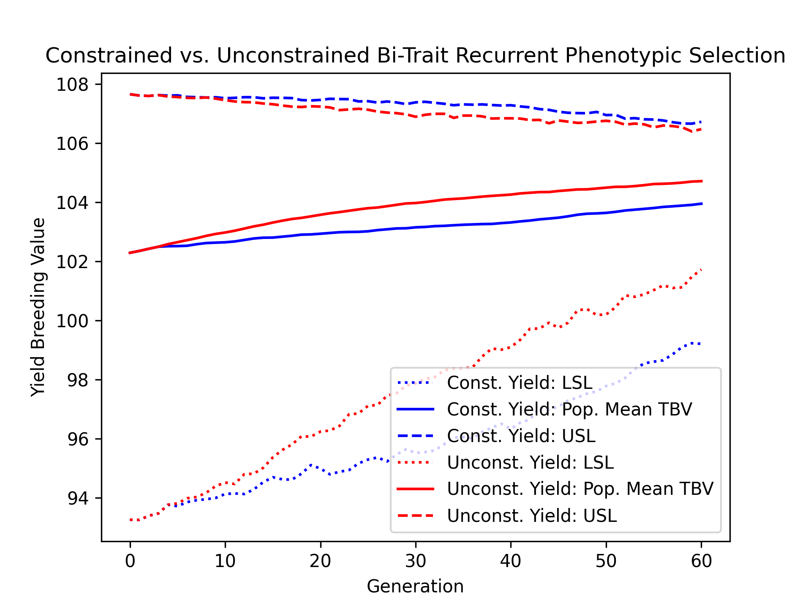
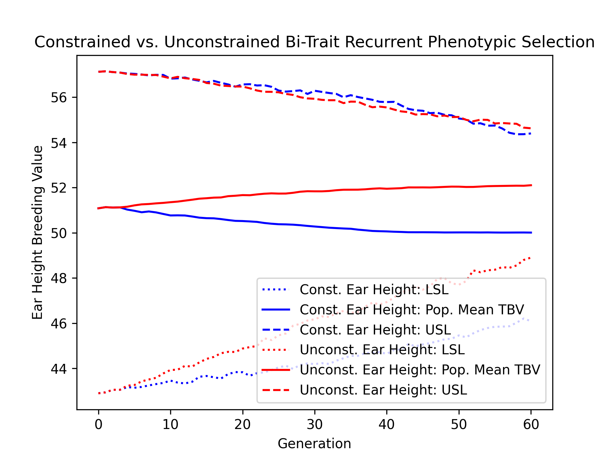
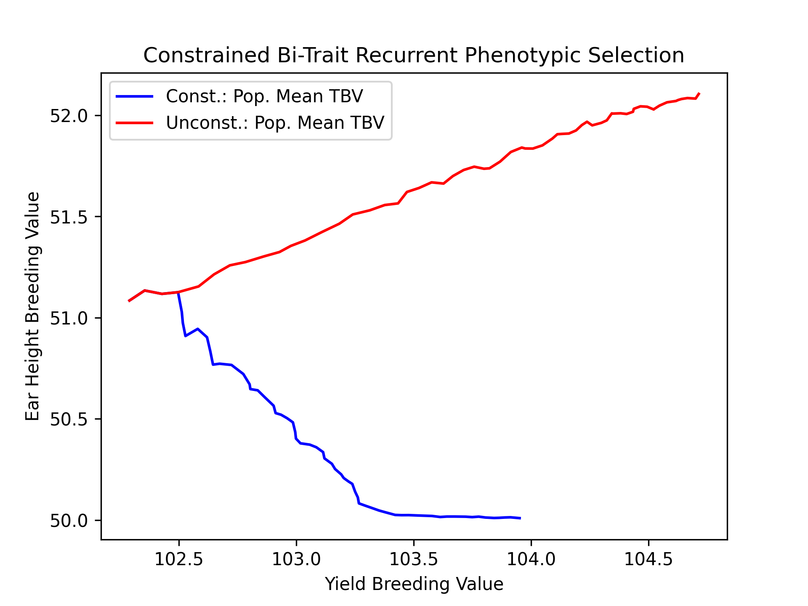
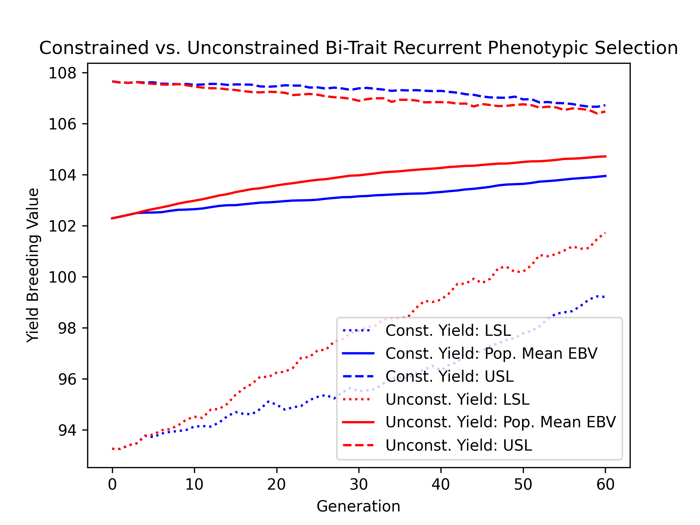
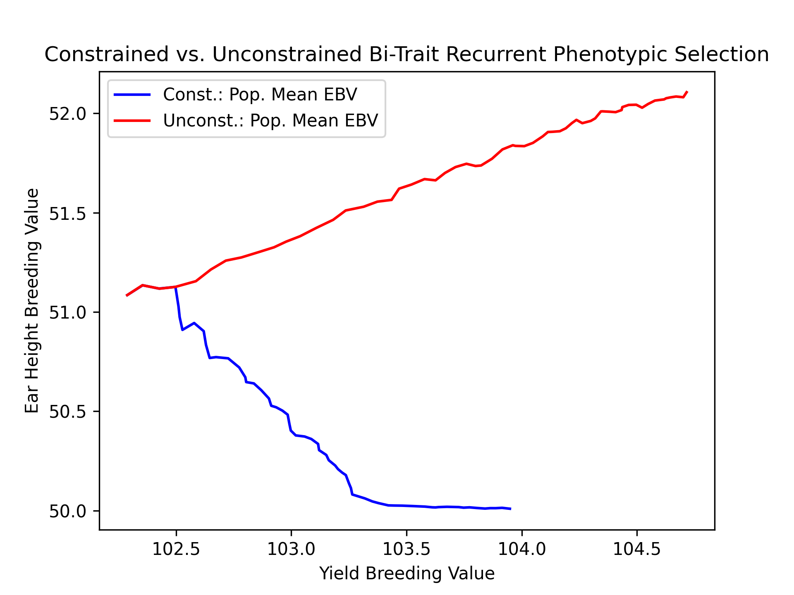
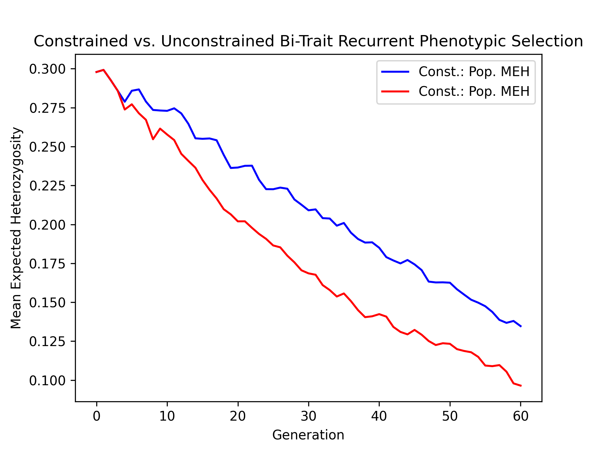
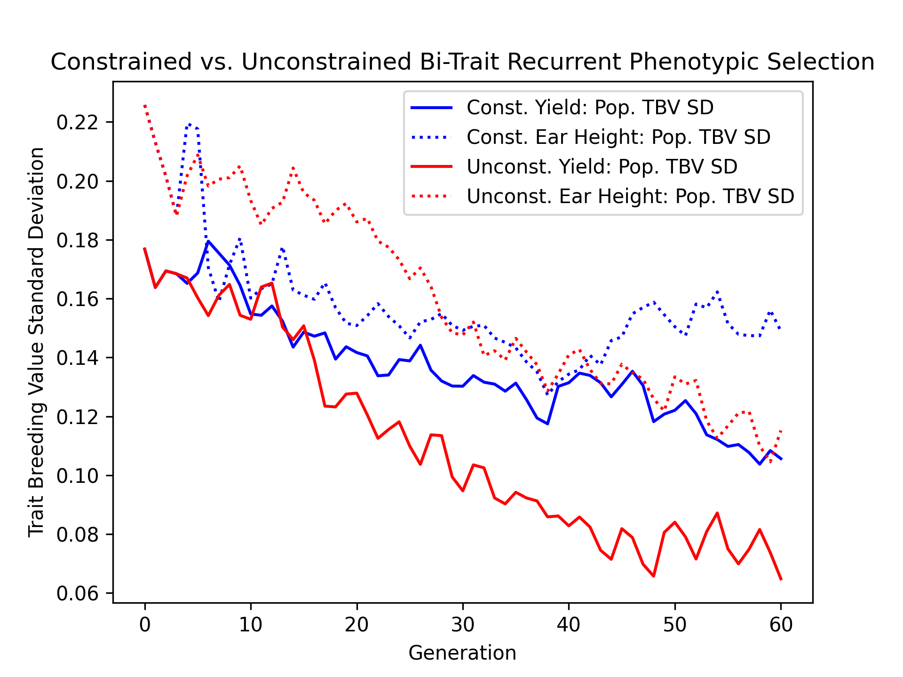
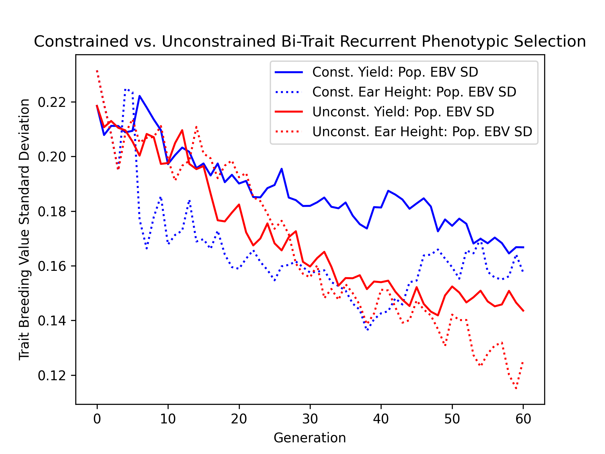
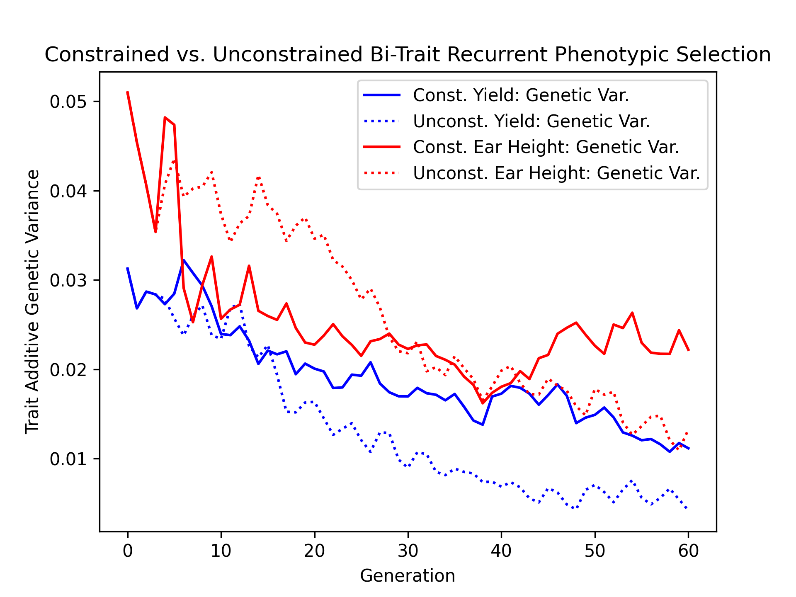
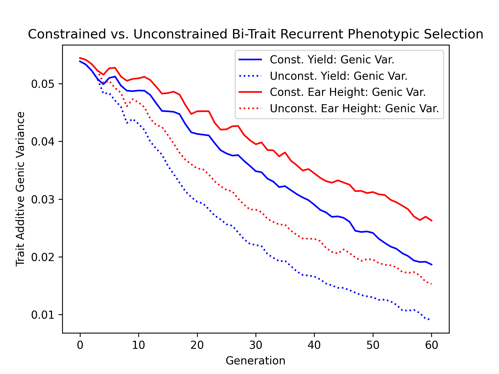

Constrained Bi-Trait Phenotypic Selection
#########################################

Often in breeding, we desire to improve a trait while maintaining another trait's value. An example of this can be found in maize. In maize, breeders seek to maximize yield while maintaining a lower ear height. Having a lower ear height is a desirable attribute in case of stalk lodging. If a plant stalk lodges, plants with lower ears are less likely to lose their ears, preserving yields.

In this example, we demonstrate how another trait can be used as a constraint for selection. We compare this constrained scenario against an unconstrained scenario.

Simulation Preliminaries
========================

Loading Required Modules and Seeding the global PRNG
----------------------------------------------------

To begin, we import the various modules we will be used into the Python namespace. We also set the seed for our simulation so that we can replicate the results at a later time.

.. code-block:: python

    # import libraries
    import copy
    import numpy
    import pandas
    import pybrops
    from matplotlib import pyplot
    from pybrops.breed.prot.bv.MeanPhenotypicBreedingValue import MeanPhenotypicBreedingValue
    from pybrops.breed.prot.gt.DenseUnphasedGenotyping import DenseUnphasedGenotyping
    from pybrops.breed.prot.mate.MatingProtocol import MatingProtocol
    from pybrops.breed.prot.mate.TwoWayCross import TwoWayCross
    from pybrops.breed.prot.mate.TwoWayDHCross import TwoWayDHCross
    from pybrops.breed.prot.pt.G_E_Phenotyping import G_E_Phenotyping
    from pybrops.breed.prot.sel.EstimatedBreedingValueSelection import EstimatedBreedingValueSubsetSelection
    from pybrops.model.gmod.DenseAdditiveLinearGenomicModel import DenseAdditiveLinearGenomicModel
    from pybrops.opt.algo.SortingSubsetOptimizationAlgorithm import SortingSubsetOptimizationAlgorithm
    from pybrops.opt.algo.SteepestDescentSubsetHillClimber import SteepestDescentSubsetHillClimber
    from pybrops.popgen.bvmat.DenseBreedingValueMatrix import DenseBreedingValueMatrix
    from pybrops.popgen.gmap.HaldaneMapFunction import HaldaneMapFunction
    from pybrops.popgen.gmap.StandardGeneticMap import StandardGeneticMap
    from pybrops.popgen.gmat.DenseGenotypeMatrix import DenseGenotypeMatrix
    from pybrops.popgen.gmat.DensePhasedGenotypeMatrix import DensePhasedGenotypeMatrix

    # seed python random and numpy random
    pybrops.core.random.prng.seed(82651560)

Simulation Parameters
---------------------

Next, we define a couple of simulation parameter constants.

.. code-block:: python

    nfndr = 40      # number of founder individuals
    nqtl = 1000     # number of QTL
    qlen = 6        # length of the queue
    ncross = 20     # number of cross configurations
    nparent = 2     # number of parents per cross configuration
    nmating = 1     # number of times to perform cross configuration
    nprogeny = 80   # number of progenies per cross attempt
    nrandmate = 20  # number of random intermatings
    nsimul = 60     # number of simulation generations

Loading Genetic Map Data from a Text File
-----------------------------------------

Then, we load genetic map data from a CSV-like file. In this example, we are using the US NAM genetic map constructed by McMullen et al. in 2009. The code below demonstrates how these data are read into a ``StandardGeneticMap`` object using the ``from_csv`` class method.

.. code-block:: python

    # read genetic map
    gmap = StandardGeneticMap.from_csv(
        "McMullen_2009_US_NAM.gmap", # file name
        vrnt_chrgrp_col     = "chr", # chromosome column
        vrnt_phypos_col     = "pos", # physical position column
        vrnt_genpos_col     = "cM",  # genetic position column
        vrnt_genpos_units   = "cM",  # genetic position units
        auto_group          = True,  # automatically group markers
        auto_build_spline   = True,  # automatically build splines
        sep                 = "\t",  # fields are tab separated
        header              = 0,     # use first line as header
    )

Creating a Genetic Map Function
-------------------------------

After loading our genetic map data, we want to create a genetic map function object which will be used to calculate recombination probabilities for our simulations. We create a simple Haldane genetic map function using the ``HaldaneMapFunction`` class.

.. code-block:: python

    # use Haldane map function to calculate crossover probabilities
    gmapfn = HaldaneMapFunction()

Loading Genome Data from a VCF File
-----------------------------------

Next, we load phased genetic markers from a VCF file. In this example, we are using a subset of genetic markers from the Wisconsin Maize Diversity Panel, which is composed of 942 individuals. 2000 SNPs with a minor allele frequency greater than 0.2 have been randomly selected to keep the dataset small. From the original 942 individuals and 2000 SNPs, we randomly select 40 founders and 1000 SNPs to create a founding synthetic population.

.. code-block:: python

    # read phased genetic markers from a vcf file
    fndr_pgmat = DensePhasedGenotypeMatrix.from_vcf("widiv_2000SNPs.vcf.gz", auto_group_vrnt=False)

    # randomly select ``nfndr`` from which to create a founding population
    ix = numpy.random.choice(fndr_pgmat.ntaxa, nfndr, replace = False)
    fndr_pgmat = fndr_pgmat.select_taxa(ix)

    # randomly select ``nqtl`` markers from founders
    ix = numpy.random.choice(fndr_pgmat.nvrnt, nqtl, replace = False)
    fndr_pgmat = fndr_pgmat.select_vrnt(ix)

    # sort and group variants
    fndr_pgmat.group_vrnt()

After loading the genetic markers, we interpolate the genetic map positions and the sequential marker crossover probabilities using the ``interp_xoprob`` method. We interpolate using the genetic map and genetic map function we have just created.

.. code-block:: python

    # interpolate genetic map positions
    fndr_pgmat.interp_xoprob(gmap, gmapfn)

Constructing a Bi-Trait Genomic Model
-------------------------------------

Next, we want to construct a true genomic model that will model two traits with a strictly additive genetic architectures. We'll name these two traits ``"yield"`` for yield and ``"earht"`` for ear height. We'll simulate pleiotropy by how we generate marker effects. We'll use a multivariate normal distribution to draw yield and ear height marker effects. The marker effects will have a covariance structure such that the correlation between their effects is 0.4. In other words, individuals with higher ear height yield more.

.. code-block:: python

    # model intercepts: (1,ntrait=2)
    beta = numpy.array([[100.0, 50.0]], dtype = float)

    # create the mean marker effect for a bi-trait model
    mean = numpy.array([0.0, 0.0])

    # for this example, we'll create two traits that have positive covariance
    # one of these traits we'll want to improve indefinitely
    # for the other trait, we'll want to impose a limit on its value for breeding
    # the traits below have a correlation of +0.4 and variance of 0.00010 (sd = 0.01)
    cov = numpy.array([
        [0.00010, 0.00004],
        [0.00004, 0.00010]
    ])

    # generate marker effects: (nvnrt, ntrait=2)
    mkreffect = numpy.random.multivariate_normal(
        mean = mean,
        cov  = cov,
        size = fndr_pgmat.nvrnt
    )

    # we'll create two mock traits named ``yield`` and ``earht`` (ear height)
    # we'll want to increase yield as much as possible
    # we'll want to constrain ear height to a specific limit
    # trait names: (ntrait=2,)
    trait = numpy.array(["yield","earht"], dtype = object)

    # create an additive linear genomic model to model traits
    algmod = DenseAdditiveLinearGenomicModel(
        beta        = beta,             # model intercepts
        u_misc      = None,             # miscellaneous random effects
        u_a         = mkreffect,        # random marker effects
        trait       = trait,            # trait names
        model_name  = "bitrait_model",  # name of the model
        hyperparams = None,             # model parameters
    )

Build Founder Populations & Run Breeding Program Burn-In
========================================================

In this next series of steps, we'll create a founder population by randomly intermating our 40 selected founders for 20 generations. Following random intermating, we'll create 6 cohorts of doubled haploid individuals, each cohort representing progenies produced in a single year. In this simulation, the oldest 3 cohorts will be aggregated into a ``"main"`` population to serve as selection candidates. The youngest 3 cohorts will be "in the pipeline" and will represent doubled haploid progenies which are being made. From the ``"main"`` population, the top 5% of individuals for yield from each family will be selected to form a ``"cand"`` population. It is from this ``"cand"`` population that parents will be selected. In the burn-in, yield is the only trait considered for selection from the ``"cand"`` population. The burn-in segment of the breeding program continues until the mean expected heterozygosity decreases to just under 0.3. After this point is reached, the simulated populations are ready for use in the main simulation.

Randomly Intermate for ``nrandmate`` Generations
------------------------------------------------

To start our random mating scheme, we first randomly pair up our 40 founders and mate them to create hybrids. Each mating event creates 80 progenies. This creates a population of size 1600.

.. code-block:: python

    # create 2-way cross object
    mate2way = TwoWayCross()

    # randomly select and pair founders
    xconfig = numpy.random.choice(nfndr, nfndr, replace = False)
    xconfig = xconfig.reshape(nfndr // 2, 2)

    # randomly intermate ``nfndr`` founders to create initial hybrids
    fndr_pgmat = mate2way.mate(
        pgmat = fndr_pgmat,
        xconfig = xconfig,
        nmating = nmating,
        nprogeny = nprogeny,
    )

Then, we take our hybrid progenies, randomly pair them up with each other, and mate them. Each mating event produces 1 progeny. We randomly intermate progenies for 20 generations to create a founding population.

.. code-block:: python

    # randomly intermate for ``nrandmate`` generations
    # each individual in the population is randomly mated with another individual
    # and creates a single progeny so that the population size is held constant
    for gen in range(1,nrandmate+1):
        # randomly select and pair ``ntaxa`` parents
        ntaxa = fndr_pgmat.ntaxa
        xconfig = numpy.empty((ntaxa,2), dtype = int)
        xconfig[:,0] = numpy.random.choice(ntaxa, ntaxa, replace = False)
        xconfig[:,1] = numpy.random.choice(ntaxa, ntaxa, replace = False)
        # randomly intermate ``ntaxa`` parents
        fndr_pgmat = mate2way.mate(
            pgmat = fndr_pgmat,
            xconfig = xconfig,
            nmating = 1,
            nprogeny = 1,
        )
        print("Random Intermating:", gen)

Create Breeding Protocols for Burn-In
-------------------------------------

Next, we make a 2-way DH cross protocol for our burn-in stage.

.. code-block:: python

    # create a 2-way DH cross object, use the counters from the 2-way cross object
    mate2waydh = TwoWayDHCross(
        progeny_counter = mate2way.progeny_counter,
        family_counter  = mate2way.family_counter,
    )

We also create a genotyping protocol that converts phased genotypes to unphased genotypes.

.. code-block:: python

    # create a genotyping protocol
    gtprot = DenseUnphasedGenotyping()

To simulate phenotypes, we create a simple :math:`G+E` phenotyping protocol that phenotypes individuals in 4 locations, 1 replication each location. We use the founding population we have just created with random mating to set the narrow sense heritability at the single plot level to 0.4 for yield and 0.8 for ear height.

.. code-block:: python

    # create a phenotyping protocol
    ptprot = G_E_Phenotyping(algmod, 4, 1)
    # yield h2 = 0.4; earht h2 = 0.8
    ptprot.set_h2(numpy.array([0.4, 0.8]), fndr_pgmat)

Next, we create a breeding value estimation protocol that simply uses means to estimate breeding value.

.. code-block:: python

    # create a breeding value estimation protocol
    bvprot = MeanPhenotypicBreedingValue("taxa", "taxa_grp", trait)

Create a Within-Family Selection Function
-----------------------------------------

Next, we create a custom function to manually select individuals within families based on their breeding values. This function selects the top ``nindiv`` individuals within each family and outputs a set of indices corresponding to these individuals.

.. code-block:: python

    # define function to do within family selection based on yield
    def within_family_selection(bvmat: DenseBreedingValueMatrix, nindiv: int) -> numpy.ndarray:
        order = numpy.arange(bvmat.ntaxa)
        value = bvmat.mat[:,0] # get yield breeding values
        indices = []
        groups = numpy.unique(bvmat.taxa_grp)
        for group in groups:
            mask = bvmat.taxa_grp == group
            tmp_order = order[mask]
            tmp_value = value[mask]
            value_argsort = tmp_value.argsort()
            ix = value_argsort[::-1][:nindiv]
            indices.append(tmp_order[ix])
        indices = numpy.concatenate(indices)
        return indices

Create Cohort Structure
-----------------------

In the next step, we create a cohort structure as described at the beginning of this section. We utilize dictionaries to keep track of our cohorts and populations.

.. code-block:: python

    # create a dictionary to store founder individuals
    fndr_genome = {"cand":None,   "main":None,   "queue":[]}
    fndr_geno   = {"cand":None,   "main":None,   "queue":[]}
    fndr_pheno  = {"cand":None,   "main":None}
    fndr_bval   = {"cand":None,   "main":None}
    fndr_gmod   = {"cand":algmod, "main":algmod, "true":algmod}

In the code block below, we define a helper function to help us create initial cohorts of individuals from our starting randomly mated population.

.. code-block:: python

    # define a helper function to help make cohorts of individuals
    def cohort(
            mate2waydh: MatingProtocol, 
            pgmat: DensePhasedGenotypeMatrix, 
            ncross: int, 
            nparent: int,
            nmating: int, 
            nprogeny: int
        ) -> DensePhasedGenotypeMatrix:
        # sample indicies of individuals and reshape for input into mating protocol
        xconfix = numpy.random.choice(pgmat.ntaxa, ncross * nparent, replace = False)
        xconfig = xconfix.reshape(ncross, nparent)
        # mate individuals
        out = mate2waydh.mate(pgmat, xconfig, nmating, nprogeny)
        return out

Next, we fill our cohort queue and construct the ``"main"`` and ``"cand"`` populations from the queue.

.. code-block:: python

    # fill queue with cohort genomes derived from randomly mating the founders
    fndr_genome["queue"] = [cohort(mate2waydh, fndr_pgmat, ncross, nparent, nmating, nprogeny) for _ in range(qlen)]

    # construct the main population genomes from the first three cohorts in the queue
    fndr_genome["main"] = DensePhasedGenotypeMatrix.concat_taxa(fndr_genome["queue"][0:3])

    # genotype individuals to fill the genotyping queue
    fndr_geno["queue"] = [gtprot.genotype(genome) for genome in fndr_genome["queue"]]

    # construct the main population genotypes from the first three cohorts in the queue
    fndr_geno["main"] = DenseGenotypeMatrix.concat_taxa(fndr_geno["queue"][0:3])

    # phenotype the main population
    fndr_pheno["main"] = ptprot.phenotype(fndr_genome["main"])

    # calculate breeding values for the main population
    fndr_bval["main"] = bvprot.estimate(fndr_pheno["main"], fndr_geno["main"])

    # calculate indices for within family selection to get parental candidates
    ix = within_family_selection(fndr_bval["main"], 4) # select top 5%

    # select parental candidates
    fndr_genome["cand"] = fndr_genome["main"].select_taxa(ix)
    fndr_geno["cand"]   = fndr_geno["main"].select_taxa(ix)
    fndr_bval["cand"]   = fndr_bval["main"].select_taxa(ix)

Create a Burn-In Selection Protocol Object
------------------------------------------

Next, we create a selection protocol for our burn-in loop. This selects individuals with the best breeding values for only our yield trait.

.. code-block:: python

    # define an objective transformation function
    def obj_trans(
            decnvec: numpy.ndarray,
            latentvec: numpy.ndarray, 
            **kwargs: dict
        ) -> numpy.ndarray:
        """
        Receive an incoming vector of [-BV1,-BV2] and transform it to
        [-BV1].

        Where::
        
            - -BV1 is the nth negated mean yield breeding value for the subset.
            - -BV2 is the nth negated mean earht breeding value for the subset.

        Parameters
        ----------
        decnvec : numpy.ndarray
            A decision space vector of shape (ndecn,)
        latentvec : numpy.ndarray
            A latent space function vector of shape (ntrait,)
        
        Returns
        -------
        out : numpy.ndarray
            A vector of shape (1,).
        """
        # extract yield as the sole objective
        return latentvec[0:1]

    # use a hillclimber for the single-objective optimization algorithm
    soalgo = SortingSubsetOptimizationAlgorithm()

    # create a selection protocol that selects based on EBVs with an inbreeding constraint
    burnin_selprot = EstimatedBreedingValueSubsetSelection(
        ntrait       = 2,            # number of expected traits
        unscale      = True,         # unscale breeding values to human-readable format
        ncross       = 20,           # number of cross configurations
        nparent      = 2,            # number of parents per cross configuration
        nmating      = 1,            # number of matings per cross configuration
        nprogeny     = 80,           # number of progeny per mating event
        nobj         = 1,            # number of objectives == 1 == yield
        obj_trans    = obj_trans,    # latent vector transformation to create objective function
        soalgo       = soalgo,       # use sorting algorithm to solve single-objective problem
    )

Running a Population Burn-in until MEH is slightly less than 0.30
-----------------------------------------------------------------

Finally, we perform selection on our populations until the mean expected heterozygosity of the ``"main"`` population reaches slightly less than 0.30. This in effect sets the starting genetic diversity for our simulations so that they are not as dependent on the set of founders that were initially randomly selected.

.. code-block:: python

    i = 0
    while fndr_genome["main"].meh() > 0.30:
        # parental selection: select parents from parental candidates
        selcfg = burnin_selprot.select(
            pgmat = fndr_genome["cand"],
            gmat  = fndr_geno["cand"],
            ptdf  = fndr_pheno["cand"],
            bvmat = fndr_bval["cand"],
            gpmod = fndr_gmod["cand"],
            t_cur = 0,
            t_max = 0,
        )
        # mate: create new genomes; discard oldest cohort; concat new main population
        new_genome = mate2waydh.mate(
            pgmat    = selcfg.pgmat,
            xconfig  = selcfg.xconfig,
            nmating  = selcfg.nmating,
            nprogeny = selcfg.nprogeny,
        )
        fndr_genome["queue"].append(new_genome)
        discard = fndr_genome["queue"].pop(0)
        fndr_genome["main"] = DensePhasedGenotypeMatrix.concat_taxa(fndr_genome["queue"][0:3])
        # evaluate: genotype new genomes; discard oldest cohort; concat new main population
        new_geno = gtprot.genotype(new_genome)
        fndr_geno["queue"].append(new_geno)
        discard = fndr_geno["queue"].pop(0)
        fndr_geno["main"] = DenseGenotypeMatrix.concat_taxa(fndr_geno["queue"][0:3])
        # evaluate: phenotype main population
        fndr_pheno["main"] = ptprot.phenotype(fndr_genome["main"])
        # evaluate: calculate breeding values for the main population
        fndr_bval["main"] = bvprot.estimate(fndr_pheno["main"], fndr_geno["main"])
        # survivor selection: select parental candidate indices from main population
        ix = within_family_selection(fndr_bval["main"], 4) # select top 5%
        # survivor selection: select parental candidates from main population
        fndr_genome["cand"] = fndr_genome["main"].select_taxa(ix)
        fndr_geno["cand"] = fndr_geno["main"].select_taxa(ix)
        fndr_bval["cand"] = fndr_bval["main"].select_taxa(ix)
        print("Burn-in:", i+1)
        i += 1

    print("Starting MEH:", fndr_genome["main"].meh())

Simulation Setup
================

In the sections above, we created the starting point for our simulations. In these next sections, we'll test two selection strategies: one constrained by a maximum ear height of 50, and another unconstrained by ear height. We'll plot and compare the yield and ear height results of these simulations.

Constructing a Constrained EBV Subset Selection Object
------------------------------------------------------

First, we'll define a selection protocol where individuals are selected on their yield breeding values subject to an ear height constraint of 50. We'll use the ``EstimatedBreedingValueSubsetSelection`` class to accomplish this task and provide objective and inequality constraint violation transformation functions to create such a scenario.

.. code-block:: python

    # define an objective transformation function
    def obj_trans(
            decnvec: numpy.ndarray,
            latentvec: numpy.ndarray, 
            **kwargs: dict
        ) -> numpy.ndarray:
        """
        Receive an incoming vector of [-BV1,-BV2] and transform it to
        [-BV1].

        Where::
        
            - -BV1 is the negated mean yield breeding value for the subset.
            - -BV2 is the negated mean earht breeding value for the subset.

        Parameters
        ----------
        decnvec : numpy.ndarray
            A decision space vector of shape (ndecn,)
        latentvec : numpy.ndarray
            A latent space function vector of shape (ntrait,)
        
        Returns
        -------
        out : numpy.ndarray
            A vector of shape (1,).
        """
        # extract yield as the sole objective
        return latentvec[0:1]

    # define an inequality constraint violation function
    def ineqcv_trans(
            decnvec: numpy.ndarray,
            latentvec: numpy.ndarray, 
            **kwargs: dict
        ) -> numpy.ndarray:
        """
        Receive an incoming vector of [-BV1,-BV2] and transform it to
        [CV2].

        Where::
        
            - -BV1 is the negated mean yield breeding value for the subset.
            - -BV2 is the negated mean earht breeding value for the subset.
            - CV2 is the constrain violation for a earht breeding value that exceeds 50.0.

        Parameters
        ----------
        decnvec : numpy.ndarray
            A decision space vector of shape (ndecn,)
        latentvec : numpy.ndarray
            A latent space function vector of shape (1+ntrait,)
        
        Returns
        -------
        out : numpy.ndarray
            An inequality constraint violation vector of shape (1,).
        """
        # calculate constraint violation for earht
        out = numpy.maximum(-50.0 - latentvec[1:2], 0.0)
        # return inequality constraint violation array
        return out

    # use a hillclimber for the single-objective optimization algorithm
    soalgo = SteepestDescentSubsetHillClimber()

    # create a selection protocol that selects based on EBVs with an EBV constraint
    const_selprot = EstimatedBreedingValueSubsetSelection(
        ntrait       = 2,            # number of expected traits
        unscale      = True,         # unscale breeding values to human-readable format
        ncross       = 20,           # number of cross configurations
        nparent      = 2,            # number of parents per cross configuration
        nmating      = 1,            # number of matings per cross configuration
        nprogeny     = 80,           # number of progeny per mating event
        nobj         = 1,            # number of objectives == 1 == yield
        obj_trans    = obj_trans,    # latent vector transformation to create objective vector
        nineqcv      = 1,            # number of inequality constraints == 1 == max(earht - 60, 0)
        ineqcv_trans = ineqcv_trans, # latent vector transformation to create inequality constraint violation vector
        soalgo       = soalgo,       # use sorting algorithm to solve single-objective problem
    )

Create an Unconstrained Selection Protocol Object
-------------------------------------------------

Second, we'll define a selection protocol where individuals are selected on their yield breeding values and ear height is ignored. As before, we'll use the ``EstimatedBreedingValueSubsetSelection`` class to accomplish this task and provide an objective transformation function to create such a scenario.

.. code-block:: python

    # define an objective transformation function
    def obj_trans(
            decnvec: numpy.ndarray,
            latentvec: numpy.ndarray, 
            **kwargs: dict
        ) -> numpy.ndarray:
        """
        Receive an incoming vector of [-BV1,-BV2] and transform it to
        [-BV1].

        Where::
        
            - -BV1 is the negated mean yield breeding value for the subset.
            - -BV2 is the negated mean earht breeding value for the subset.

        Parameters
        ----------
        decnvec : numpy.ndarray
            A decision space vector of shape (ndecn,)
        latentvec : numpy.ndarray
            A latent space function vector of shape (ntrait,)
        
        Returns
        -------
        out : numpy.ndarray
            A vector of shape (1,).
        """
        # extract yield as the sole objective
        return latentvec[0:1]

    # use a sorting algorithm for the single-objective optimization algorithm
    soalgo = SortingSubsetOptimizationAlgorithm()

    # create a selection protocol that selects based on EBVs with an inbreeding constraint
    unconst_selprot = EstimatedBreedingValueSubsetSelection(
        ntrait       = 2,            # number of expected traits
        unscale      = True,         # unscale breeding values to human-readable format
        ncross       = 20,           # number of cross configurations
        nparent      = 2,            # number of parents per cross configuration
        nmating      = 1,            # number of matings per cross configuration
        nprogeny     = 80,           # number of progeny per mating event
        nobj         = 1,            # number of objectives == ntrait
        obj_trans    = obj_trans,    # latent vector transformation to create objective vector
        soalgo       = soalgo,       # use sorting algorithm to solve single-objective problem
    )

Make a Statistics Recording Helper Function
-------------------------------------------

To assist in record keeping, we'll create a function to help us record simulation metrics and store them into a dictionary.

.. code-block:: python

    # make recording helper function
    def record(lbook: dict, gen: int, genome: dict, geno: dict, pheno: dict, bval: dict, gmod: dict) -> None:
        lbook["gen"].append(gen)
        lbook["main_meh"].append(genome["main"].meh())
        ################### main true lower selection limits ###################
        tmp = gmod["true"].lsl(genome["main"], unscale = True)
        lbook["main_yield_lsl"].append(tmp[0])
        lbook["main_earht_lsl"].append(tmp[1])
        ################### main true lower selection limits ###################
        tmp = gmod["true"].usl(genome["main"], unscale = True)
        lbook["main_yield_usl"].append(tmp[0])
        lbook["main_earht_usl"].append(tmp[1])
        ###################### main true breeding values #######################
        tbv = gmod["true"].gebv(genome["main"])
        ################## main true breeding value minimums ###################
        tmp = tbv.tmin(unscale = True)
        lbook["main_yield_tbv_min"].append(tmp[0])
        lbook["main_earht_tbv_min"].append(tmp[1])
        #################### main true breeding value means ####################
        tmp = tbv.tmean(unscale = True)
        lbook["main_yield_tbv_mean"].append(tmp[0])
        lbook["main_earht_tbv_mean"].append(tmp[1])
        ################## main true breeding value maximums ###################
        tmp = tbv.tmax(unscale = True)
        lbook["main_yield_tbv_max"].append(tmp[0])
        lbook["main_earht_tbv_max"].append(tmp[1])
        ############# main true breeding value standard deviations #############
        tmp = tbv.tstd(unscale = True)
        lbook["main_yield_tbv_std"].append(tmp[0])
        lbook["main_earht_tbv_std"].append(tmp[1])
        ##################### main true genetic variances ######################
        tmp = gmod["true"].var_A(genome["main"])
        lbook["main_yield_tbv_var_A"].append(tmp[0])
        lbook["main_earht_tbv_var_A"].append(tmp[1])
        ###################### main true genic variances #######################
        tmp = gmod["true"].var_a(genome["main"])
        lbook["main_yield_tbv_var_a"].append(tmp[0])
        lbook["main_earht_tbv_var_a"].append(tmp[1])
        #################### main estimated breeding values ####################
        ebv = bval["main"]
        ################ main estimated breeding value minimums ################
        tmp = ebv.tmin(unscale = True)
        lbook["main_yield_ebv_min"].append(tmp[0])
        lbook["main_earht_ebv_min"].append(tmp[1])
        #################### main true breeding value means ####################
        tmp = ebv.tmean(unscale = True)
        lbook["main_yield_ebv_mean"].append(tmp[0])
        lbook["main_earht_ebv_mean"].append(tmp[1])
        ################## main true breeding value maximums ###################
        tmp = ebv.tmax(unscale = True)
        lbook["main_yield_ebv_max"].append(tmp[0])
        lbook["main_earht_ebv_max"].append(tmp[1])
        ############# main true breeding value standard deviations #############
        tmp = ebv.tstd(unscale = True)
        lbook["main_yield_ebv_std"].append(tmp[0])
        lbook["main_earht_ebv_std"].append(tmp[1])

Running a Constrained Breeding Simulations for 60 Generations
=============================================================

The next subsections detail simulations in the constrained scenario.

Copy Founders
-------------

First we'll copy our founder populations so that we don't modify them and can use them for repeated simulations.

.. code-block:: python

    # deep copy founder populations, bvals, etc. so we can replicate if needed
    simul_genome = copy.deepcopy(fndr_genome)
    simul_geno   = copy.deepcopy(fndr_geno)
    simul_pheno  = copy.deepcopy(fndr_pheno)
    simul_bval   = copy.deepcopy(fndr_bval)
    simul_gmod   = copy.deepcopy(fndr_gmod)

Rudimentary Logbooks
--------------------

Then, we'll make a dictionary logbook to store simulation metrics.

.. code-block:: python

    # make a dictionary logbook
    const_lbook = {
        "gen"                 : [],
        "main_meh"            : [],
        # yield metrics
        "main_yield_lsl"      : [],
        "main_yield_usl"      : [],
        "main_yield_tbv_min"  : [],
        "main_yield_tbv_mean" : [],
        "main_yield_tbv_max"  : [],
        "main_yield_tbv_std"  : [],
        "main_yield_tbv_var_A": [],
        "main_yield_tbv_var_a": [],
        "main_yield_ebv_min"  : [],
        "main_yield_ebv_mean" : [],
        "main_yield_ebv_max"  : [],
        "main_yield_ebv_std"  : [],
        # earht metrics
        "main_earht_lsl"      : [],
        "main_earht_usl"      : [],
        "main_earht_tbv_min"  : [],
        "main_earht_tbv_mean" : [],
        "main_earht_tbv_max"  : [],
        "main_earht_tbv_std"  : [],
        "main_earht_tbv_var_A": [],
        "main_earht_tbv_var_a": [],
        "main_earht_ebv_min"  : [],
        "main_earht_ebv_mean" : [],
        "main_earht_ebv_max"  : [],
        "main_earht_ebv_std"  : [],
    }

Simulation Main Loop
--------------------

Next, we'll simulate our constrained scenario breeding program for 60 generations.

.. code-block:: python

    # record initial statistics
    record(const_lbook, 0, simul_genome, simul_geno, simul_pheno, simul_bval, simul_gmod)

    # main simulation loop
    for gen in range(1,nsimul+1):
        # parental selection: select parents from parental candidates
        selcfg = const_selprot.select(
            pgmat = simul_genome["cand"],
            gmat  = simul_geno["cand"],
            ptdf  = simul_pheno["cand"],
            bvmat = simul_bval["cand"],
            gpmod = simul_gmod["cand"],
            t_cur = 0,
            t_max = 0,
        )
        # mate: create new genomes; discard oldest cohort; concat new main population
        new_genome = mate2waydh.mate(
            pgmat    = selcfg.pgmat,
            xconfig  = selcfg.xconfig,
            nmating  = selcfg.nmating,
            nprogeny = selcfg.nprogeny,
        )
        simul_genome["queue"].append(new_genome)
        discard = simul_genome["queue"].pop(0)
        simul_genome["main"] = DensePhasedGenotypeMatrix.concat_taxa(simul_genome["queue"][0:3])
        # evaluate: genotype new genomes; discard oldest cohort; concat new main population
        new_geno = gtprot.genotype(new_genome)
        simul_geno["queue"].append(new_geno)
        discard = simul_geno["queue"].pop(0)
        simul_geno["main"] = DenseGenotypeMatrix.concat_taxa(simul_geno["queue"][0:3])
        # evaluate: phenotype main population
        simul_pheno["main"] = ptprot.phenotype(simul_genome["main"])
        # evaluate: calculate breeding values for the main population
        simul_bval["main"] = bvprot.estimate(simul_pheno["main"], simul_geno["main"])
        # survivor selection: select parental candidate indices from main population
        ix = within_family_selection(simul_bval["main"], 4) # select top 5%
        # survivor selection: select parental candidates from main population
        simul_genome["cand"] = simul_genome["main"].select_taxa(ix)
        simul_geno["cand"] = simul_geno["main"].select_taxa(ix)
        simul_bval["cand"] = simul_bval["main"].select_taxa(ix)
        # record statistics
        record(const_lbook, gen, simul_genome, simul_geno, simul_pheno, simul_bval, simul_gmod)
        print("Generation:", gen)

Saving Results to a File
------------------------

Finally, we'll save the results of our simulation to a CSV file.

.. code-block:: python

    # create output dataframe and save
    const_lbook_df = pandas.DataFrame(const_lbook)
    const_lbook_df.to_csv("const_lbook.csv", sep = ",", index = False)

Running an Unconstrained Breeding Simulations for 60 Generations
================================================================

Copy Founders
-------------

As before, we'll copy our founder populations so that we don't modify them and can use them for repeated simulations.

.. code-block:: python

    # deep copy founder populations, bvals, etc. so we can replicate if needed
    simul_genome = copy.deepcopy(fndr_genome)
    simul_geno   = copy.deepcopy(fndr_geno)
    simul_pheno  = copy.deepcopy(fndr_pheno)
    simul_bval   = copy.deepcopy(fndr_bval)
    simul_gmod   = copy.deepcopy(fndr_gmod)

Rudimentary Logbooks
--------------------

Then, we'll make a dictionary logbook to store simulation metrics.

.. code-block:: python

    # make a dictionary logbook
    unconst_lbook = {
        "gen"                 : [],
        "main_meh"            : [],
        # yield metrics
        "main_yield_lsl"      : [],
        "main_yield_usl"      : [],
        "main_yield_tbv_min"  : [],
        "main_yield_tbv_mean" : [],
        "main_yield_tbv_max"  : [],
        "main_yield_tbv_std"  : [],
        "main_yield_tbv_var_A": [],
        "main_yield_tbv_var_a": [],
        "main_yield_ebv_min"  : [],
        "main_yield_ebv_mean" : [],
        "main_yield_ebv_max"  : [],
        "main_yield_ebv_std"  : [],
        # earht metrics
        "main_earht_lsl"      : [],
        "main_earht_usl"      : [],
        "main_earht_tbv_min"  : [],
        "main_earht_tbv_mean" : [],
        "main_earht_tbv_max"  : [],
        "main_earht_tbv_std"  : [],
        "main_earht_tbv_var_A": [],
        "main_earht_tbv_var_a": [],
        "main_earht_ebv_min"  : [],
        "main_earht_ebv_mean" : [],
        "main_earht_ebv_max"  : [],
        "main_earht_ebv_std"  : [],
    }

Simulation Main Loop
--------------------

Next, we'll simulate our unconstrained scenario breeding program for 60 generations.

.. code-block:: python

    # record initial statistics
    record(unconst_lbook, 0, simul_genome, simul_geno, simul_pheno, simul_bval, simul_gmod)

    # main simulation loop
    for gen in range(1,nsimul+1):
        # parental selection: select parents from parental candidates
        selcfg = unconst_selprot.select(
            pgmat = simul_genome["cand"],
            gmat  = simul_geno["cand"],
            ptdf  = simul_pheno["cand"],
            bvmat = simul_bval["cand"],
            gpmod = simul_gmod["cand"],
            t_cur = 0,
            t_max = 0,
        )
        # mate: create new genomes; discard oldest cohort; concat new main population
        new_genome = mate2waydh.mate(
            pgmat    = selcfg.pgmat,
            xconfig  = selcfg.xconfig,
            nmating  = selcfg.nmating,
            nprogeny = selcfg.nprogeny,
        )
        simul_genome["queue"].append(new_genome)
        discard = simul_genome["queue"].pop(0)
        simul_genome["main"] = DensePhasedGenotypeMatrix.concat_taxa(simul_genome["queue"][0:3])
        # evaluate: genotype new genomes; discard oldest cohort; concat new main population
        new_geno = gtprot.genotype(new_genome)
        simul_geno["queue"].append(new_geno)
        discard = simul_geno["queue"].pop(0)
        simul_geno["main"] = DenseGenotypeMatrix.concat_taxa(simul_geno["queue"][0:3])
        # evaluate: phenotype main population
        simul_pheno["main"] = ptprot.phenotype(simul_genome["main"])
        # evaluate: calculate breeding values for the main population
        simul_bval["main"] = bvprot.estimate(simul_pheno["main"], simul_geno["main"])
        # survivor selection: select parental candidate indices from main population
        ix = within_family_selection(simul_bval["main"], 4) # select top 5%
        # survivor selection: select parental candidates from main population
        simul_genome["cand"] = simul_genome["main"].select_taxa(ix)
        simul_geno["cand"] = simul_geno["main"].select_taxa(ix)
        simul_bval["cand"] = simul_bval["main"].select_taxa(ix)
        # record statistics
        record(unconst_lbook, gen, simul_genome, simul_geno, simul_pheno, simul_bval, simul_gmod)
        print("Generation:", gen)

Saving Results to a File
------------------------

Finally, we'll save the results of our simulation to a CSV file.

.. code-block:: python

    # create output dataframe and save
    unconst_lbook_df = pandas.DataFrame(unconst_lbook)
    unconst_lbook_df.to_csv("unconst_lbook.csv", sep = ",", index = False)

Visualizing Breeding Program Simulation Results with ``matplotlib``
===================================================================

Visualizing True Breeding Values (TBVs)
---------------------------------------

Using the results, we'll visualize the population mean yield true breeding values over time for the constrained and unconstrained scenarios. Additionally, we'll plot the upper and lower selection limits to depict the narrowing of the genetic diverity over time.

.. code-block:: python

    # create static figure
    fig = pyplot.figure()
    ax = pyplot.axes()
    ax.plot(const_lbook_df  ["gen"], const_lbook_df  ["main_yield_lsl"],      ':b',  label = "Const. Yield: LSL")
    ax.plot(const_lbook_df  ["gen"], const_lbook_df  ["main_yield_tbv_mean"], '-b',  label = "Const. Yield: Pop. Mean TBV")
    ax.plot(const_lbook_df  ["gen"], const_lbook_df  ["main_yield_usl"],      '--b', label = "Const. Yield: USL")
    ax.plot(unconst_lbook_df["gen"], unconst_lbook_df["main_yield_lsl"],      ':r',  label = "Unconst. Yield: LSL")
    ax.plot(unconst_lbook_df["gen"], unconst_lbook_df["main_yield_tbv_mean"], '-r',  label = "Unconst. Yield: Pop. Mean TBV")
    ax.plot(unconst_lbook_df["gen"], unconst_lbook_df["main_yield_usl"],      '--r', label = "Unconst. Yield: USL")
    ax.set_title("Constrained vs. Unconstrained Bi-Trait Recurrent Phenotypic Selection")
    ax.set_xlabel("Generation")
    ax.set_ylabel("Yield Breeding Value")
    ax.legend()
    pyplot.savefig("constr_vs_unconst_bitrait_phenotypic_selection_yield_TBV.png", dpi = 300)
    pyplot.close(fig)

The figure below is the result of the code above.

We'll also visualize the population mean ear height true breeding values over time for the constrained and unconstrained scenarios alongside their upper and lower selection limits.

.. code-block:: python

    # create static figure
    fig = pyplot.figure()
    ax = pyplot.axes()
    ax.plot(const_lbook_df  ["gen"], const_lbook_df  ["main_earht_lsl"],      ':b',  label = "Const. Ear Height: LSL")
    ax.plot(const_lbook_df  ["gen"], const_lbook_df  ["main_earht_tbv_mean"], '-b',  label = "Const. Ear Height: Pop. Mean TBV")
    ax.plot(const_lbook_df  ["gen"], const_lbook_df  ["main_earht_usl"],      '--b', label = "Const. Ear Height: USL")
    ax.plot(unconst_lbook_df["gen"], unconst_lbook_df["main_earht_lsl"],      ':r',  label = "Unconst. Ear Height: LSL")
    ax.plot(unconst_lbook_df["gen"], unconst_lbook_df["main_earht_tbv_mean"], '-r',  label = "Unconst. Ear Height: Pop. Mean TBV")
    ax.plot(unconst_lbook_df["gen"], unconst_lbook_df["main_earht_usl"],      '--r', label = "Unconst. Ear Height: USL")
    ax.set_title("Constrained vs. Unconstrained Bi-Trait Recurrent Phenotypic Selection")
    ax.set_xlabel("Generation")
    ax.set_ylabel("Ear Height Breeding Value")
    ax.legend()
    pyplot.savefig("constr_vs_unconst_bitrait_phenotypic_selection_earht_TBV.png", dpi = 300)
    pyplot.close(fig)

The figure below is the result of the code above.

Finally, we'll plot the trajectories of yield and ear height population mean true breeding values for both constrained and unconstrained scenarios.

.. code-block:: python

    # create static figure
    fig = pyplot.figure()
    ax = pyplot.axes()
    ax.plot(const_lbook_df  ["main_yield_tbv_mean"], const_lbook_df  ["main_earht_tbv_mean"], '-b',  label = "Const.: Pop. Mean TBV")
    ax.plot(unconst_lbook_df["main_yield_tbv_mean"], unconst_lbook_df["main_earht_tbv_mean"], '-r',  label = "Unconst.: Pop. Mean TBV")
    ax.set_title("Constrained Bi-Trait Recurrent Phenotypic Selection")
    ax.set_xlabel("Yield Breeding Value")
    ax.set_ylabel("Ear Height Breeding Value")
    ax.legend()
    pyplot.savefig("constr_vs_unconst_bitrait_phenotypic_selection_bitrait_TBV.png", dpi = 300)
    pyplot.close(fig)

The figure below is the result of the code above.

Visualizing Estimated Breeding Values (EBVs)
--------------------------------------------

We'll visualize the population mean yield estimated breeding values over time for the constrained and unconstrained scenarios alongside their upper and lower selection limits using the code below.

.. code-block:: python

    # create static figure
    fig = pyplot.figure()
    ax = pyplot.axes()
    ax.plot(const_lbook_df  ["gen"], const_lbook_df  ["main_yield_lsl"],      ':b',  label = "Const. Yield: LSL")
    ax.plot(const_lbook_df  ["gen"], const_lbook_df  ["main_yield_ebv_mean"], '-b',  label = "Const. Yield: Pop. Mean EBV")
    ax.plot(const_lbook_df  ["gen"], const_lbook_df  ["main_yield_usl"],      '--b', label = "Const. Yield: USL")
    ax.plot(unconst_lbook_df["gen"], unconst_lbook_df["main_yield_lsl"],      ':r',  label = "Unconst. Yield: LSL")
    ax.plot(unconst_lbook_df["gen"], unconst_lbook_df["main_yield_ebv_mean"], '-r',  label = "Unconst. Yield: Pop. Mean EBV")
    ax.plot(unconst_lbook_df["gen"], unconst_lbook_df["main_yield_usl"],      '--r', label = "Unconst. Yield: USL")
    ax.set_title("Constrained vs. Unconstrained Bi-Trait Recurrent Phenotypic Selection")
    ax.set_xlabel("Generation")
    ax.set_ylabel("Yield Breeding Value")
    ax.legend()
    pyplot.savefig("constr_vs_unconst_bitrait_phenotypic_selection_yield_EBV.png", dpi = 300)
    pyplot.close(fig)

The figure below is the result of the code above.

We'll visualize the population mean ear height estimated breeding values over time for the constrained and unconstrained scenarios alongside their upper and lower selection limits using the code below.

.. code-block:: python

    # create static figure
    fig = pyplot.figure()
    ax = pyplot.axes()
    ax.plot(const_lbook_df  ["gen"], const_lbook_df  ["main_earht_lsl"],      ':b',  label = "Const. Ear Height: LSL")
    ax.plot(const_lbook_df  ["gen"], const_lbook_df  ["main_earht_ebv_mean"], '-b',  label = "Const. Ear Height: Pop. Mean EBV")
    ax.plot(const_lbook_df  ["gen"], const_lbook_df  ["main_earht_usl"],      '--b', label = "Const. Ear Height: USL")
    ax.plot(unconst_lbook_df["gen"], unconst_lbook_df["main_earht_lsl"],      ':r',  label = "Unconst. Ear Height: LSL")
    ax.plot(unconst_lbook_df["gen"], unconst_lbook_df["main_earht_ebv_mean"], '-r',  label = "Unconst. Ear Height: Pop. Mean EBV")
    ax.plot(unconst_lbook_df["gen"], unconst_lbook_df["main_earht_usl"],      '--r', label = "Unconst. Ear Height: USL")
    ax.set_title("Constrained vs. Unconstrained Bi-Trait Recurrent Phenotypic Selection")
    ax.set_xlabel("Generation")
    ax.set_ylabel("Ear Height Breeding Value")
    ax.legend()
    pyplot.savefig("constr_vs_unconst_bitrait_phenotypic_selection_earht_EBV.png", dpi = 300)
    pyplot.close(fig)

The figure below is the result of the code above.

Finally, we'll plot the trajectories of yield and ear height population mean estimated breeding values for both constrained and unconstrained scenarios.

.. code-block:: python

    # create static figure
    fig = pyplot.figure()
    ax = pyplot.axes()
    ax.plot(const_lbook_df  ["main_yield_ebv_mean"], const_lbook_df  ["main_earht_ebv_mean"], '-b',  label = "Const.: Pop. Mean EBV")
    ax.plot(unconst_lbook_df["main_yield_ebv_mean"], unconst_lbook_df["main_earht_ebv_mean"], '-r',  label = "Unconst.: Pop. Mean EBV")
    ax.set_title("Constrained vs. Unconstrained Bi-Trait Recurrent Phenotypic Selection")
    ax.set_xlabel("Yield Breeding Value")
    ax.set_ylabel("Ear Height Breeding Value")
    ax.legend()
    pyplot.savefig("constr_vs_unconst_bitrait_phenotypic_selection_bitrait_EBV.png", dpi = 300)
    pyplot.close(fig)

The figure below is the result of the code above.

Visualizing Mean Expected Heterozygosity (MEH)
----------------------------------------------

As a metric of diverity, we'll visualize the population mean expected heterozygosity over time for the constrained and unconstrained scenarios with the code below.

.. code-block:: python

    # create static figure
    fig = pyplot.figure()
    ax = pyplot.axes()
    ax.plot(const_lbook_df  ["gen"], const_lbook_df  ["main_meh"], '-b', label = "Const.: Pop. MEH")
    ax.plot(unconst_lbook_df["gen"], unconst_lbook_df["main_meh"], '-r', label = "Const.: Pop. MEH")
    ax.set_title("Constrained vs. Unconstrained Bi-Trait Recurrent Phenotypic Selection")
    ax.set_xlabel("Generation")
    ax.set_ylabel("Mean Expected Heterozygosity")
    ax.legend()
    pyplot.savefig("constr_vs_unconst_bitrait_phenotypic_selection_mean_expected_heterozygosity.png", dpi = 300)
    pyplot.close(fig)

The figure below is the result of the code above.

Visualizing True Breeding Value Standard Deviations
---------------------------------------------------

As another metric of diversity, we'll visualize the population true breeding value standard deviation over time for the constrained and unconstrained scenarios with the code below.

.. code-block:: python

    # create static figure
    fig = pyplot.figure()
    ax = pyplot.axes()
    ax.plot(const_lbook_df  ["gen"], const_lbook_df  ["main_yield_tbv_std"], '-b', label = "Const. Yield: Pop. TBV SD")
    ax.plot(const_lbook_df  ["gen"], const_lbook_df  ["main_earht_tbv_std"], ':b', label = "Const. Ear Height: Pop. TBV SD")
    ax.plot(unconst_lbook_df["gen"], unconst_lbook_df["main_yield_tbv_std"], '-r', label = "Unconst. Yield: Pop. TBV SD")
    ax.plot(unconst_lbook_df["gen"], unconst_lbook_df["main_earht_tbv_std"], ':r', label = "Unconst. Ear Height: Pop. TBV SD")
    ax.set_title("Constrained vs. Unconstrained Bi-Trait Recurrent Phenotypic Selection")
    ax.set_xlabel("Generation")
    ax.set_ylabel("Trait Breeding Value Standard Deviation")
    ax.legend()
    pyplot.savefig("constr_vs_unconst_bitrait_phenotypic_selection_bitrait_TBV_standard_deviation.png", dpi = 300)
    pyplot.close(fig)

The figure below is the result of the code above.

Visualizing Estimated Breeding Value Standard Deviations
--------------------------------------------------------

Additionally, we'll visualize the population estimated breeding value standard deviation over time for the constrained and unconstrained scenarios with the code below.

.. code-block:: python

    # create static figure
    fig = pyplot.figure()
    ax = pyplot.axes()
    ax.plot(const_lbook_df  ["gen"], const_lbook_df  ["main_yield_ebv_std"], '-b', label = "Const. Yield: Pop. EBV SD")
    ax.plot(const_lbook_df  ["gen"], const_lbook_df  ["main_earht_ebv_std"], ':b', label = "Const. Ear Height: Pop. EBV SD")
    ax.plot(unconst_lbook_df["gen"], unconst_lbook_df["main_yield_ebv_std"], '-r', label = "Unconst. Yield: Pop. EBV SD")
    ax.plot(unconst_lbook_df["gen"], unconst_lbook_df["main_earht_ebv_std"], ':r', label = "Unconst. Ear Height: Pop. EBV SD")
    ax.set_title("Constrained vs. Unconstrained Bi-Trait Recurrent Phenotypic Selection")
    ax.set_xlabel("Generation")
    ax.set_ylabel("Trait Breeding Value Standard Deviation")
    ax.legend()
    pyplot.savefig("constr_vs_unconst_bitrait_phenotypic_selection_bitrait_EBV_standard_deviation.png", dpi = 300)
    pyplot.close(fig)

The figure below is the result of the code above.

Visualizing Genetic and Genic Variance
--------------------------------------

As a final metric of diversity, we'll visualize the population genetic and genic diversity over time for both constrained and unconstrained scenarios in the next two code blocks.

.. code-block:: python

    # create static figure
    fig = pyplot.figure()
    ax = pyplot.axes()
    ax.plot(const_lbook_df  ["gen"], const_lbook_df  ["main_yield_tbv_var_A"], '-b',  label = "Const. Yield: Genetic Var.")
    ax.plot(unconst_lbook_df["gen"], unconst_lbook_df["main_yield_tbv_var_A"], ':b',  label = "Unconst. Yield: Genetic Var.")
    ax.plot(const_lbook_df  ["gen"], const_lbook_df  ["main_earht_tbv_var_A"], '-r',  label = "Const. Ear Height: Genetic Var.")
    ax.plot(unconst_lbook_df["gen"], unconst_lbook_df["main_earht_tbv_var_A"], ':r',  label = "Unconst. Ear Height: Genetic Var.")
    ax.set_title("Constrained vs. Unconstrained Bi-Trait Recurrent Phenotypic Selection")
    ax.set_xlabel("Generation")
    ax.set_ylabel("Trait Additive Genetic Variance")
    ax.legend()
    pyplot.savefig("constr_vs_unconst_bitrait_phenotypic_selection_bitrait_genetic_variance.png", dpi = 300)
    pyplot.close(fig)

The figure below is the result of the code above.

.. code-block:: python

    # create static figure
    fig = pyplot.figure()
    ax = pyplot.axes()
    ax.plot(const_lbook_df  ["gen"], const_lbook_df  ["main_yield_tbv_var_a"], '-b',  label = "Const. Yield: Genic Var.")
    ax.plot(unconst_lbook_df["gen"], unconst_lbook_df["main_yield_tbv_var_a"], ':b',  label = "Unconst. Yield: Genic Var.")
    ax.plot(const_lbook_df  ["gen"], const_lbook_df  ["main_earht_tbv_var_a"], '-r',  label = "Const. Ear Height: Genic Var.")
    ax.plot(unconst_lbook_df["gen"], unconst_lbook_df["main_earht_tbv_var_a"], ':r',  label = "Unconst. Ear Height: Genic Var.")
    ax.set_title("Constrained vs. Unconstrained Bi-Trait Recurrent Phenotypic Selection")
    ax.set_xlabel("Generation")
    ax.set_ylabel("Trait Additive Genic Variance")
    ax.legend()
    pyplot.savefig("constr_vs_unconst_bitrait_phenotypic_selection_bitrait_genic_variance.png", dpi = 300)
    pyplot.close(fig)

The figure below is the result of the code above.

