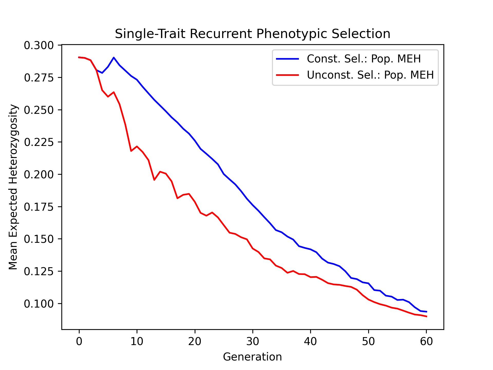

Constrained Single-Trait Phenotypic Selection
#############################################

In the :doc:`Single-Trait Phenotypic Selection example <single_trait_phenotypic_selection>`, we conducted a simulation where we selected the top individuals based on their estimated breeding values. Unfortunately, this "greedy" selection strategy quickly depletes genetic diversity, leading to poorer genetic gains in the long run. One method to combat the depletion of genetic diversity is to add an inbreeding constraint. Instead of selecting the top individuals, we select the top  individuals given that their mean relatedness does not exceed a specific value. In the example below, we perform both constrained and unconstrained selection and compare their long-term effects using simulations.

Simulation Preliminaries
========================

Loading Required Modules and Seeding the global PRNG
----------------------------------------------------

To begin, we import the various modules we will be used into the Python namespace. We also set the seed for our simulation so that we can replicate the results at a later time.

.. code-block:: python

    # import libraries
    from numbers import Real
    import numpy
    import pandas
    import pybrops
    from matplotlib import pyplot
    from pybrops.breed.prot.bv.MeanPhenotypicBreedingValue import MeanPhenotypicBreedingValue
    from pybrops.breed.prot.mate.TwoWayCross import TwoWayCross
    from pybrops.breed.prot.mate.TwoWayDHCross import TwoWayDHCross
    from pybrops.breed.prot.pt.G_E_Phenotyping import G_E_Phenotyping
    from pybrops.breed.prot.sel.EstimatedBreedingValueSelection import EstimatedBreedingValueSubsetSelection
    from pybrops.breed.prot.sel.OptimalContributionSelection import OptimalContributionSubsetSelection
    from pybrops.model.gmod.DenseAdditiveLinearGenomicModel import DenseAdditiveLinearGenomicModel
    from pybrops.opt.algo.SortingSubsetOptimizationAlgorithm import SortingSubsetOptimizationAlgorithm
    from pybrops.opt.algo.SteepestDescentSubsetHillClimber import SteepestDescentSubsetHillClimber
    from pybrops.popgen.bvmat.DenseBreedingValueMatrix import DenseBreedingValueMatrix
    from pybrops.popgen.cmat.fcty.DenseMolecularCoancestryMatrixFactory import DenseMolecularCoancestryMatrixFactory
    from pybrops.popgen.gmap.HaldaneMapFunction import HaldaneMapFunction
    from pybrops.popgen.gmap.StandardGeneticMap import StandardGeneticMap
    from pybrops.popgen.gmat.DensePhasedGenotypeMatrix import DensePhasedGenotypeMatrix

    # seed python random and numpy random
    pybrops.core.random.prng.seed(52347529)

Loading Genetic Map Data from a Text File
-----------------------------------------

Next, we load genetic map data from a CSV-like file. In this example, we are using the US NAM genetic map constructed by McMullen et al. in 2009. The code below demonstrates how these data are read into a ``StandardGeneticMap`` object using the ``from_csv`` class method.

.. code-block:: python

    # read genetic map
    gmap = StandardGeneticMap.from_csv(
        "McMullen_2009_US_NAM.gmap",
        vrnt_chrgrp_col     = "chr",
        vrnt_phypos_col     = "pos",
        vrnt_genpos_col     = "cM",
        vrnt_genpos_units   = "cM",
        auto_group          = True,
        auto_build_spline   = True,
        sep                 = "\t",
        header              = 0,
    )

Creating a Genetic Map Function
-------------------------------

After loading our genetic map data, we want to create a genetic map function object which will be used to calculate recombination probabilities for our simulations. We create a simple Haldane genetic map function using the ``HaldaneMapFunction`` class.

.. code-block:: python

    # use Haldane map function to calculate crossover probabilities
    gmapfn = HaldaneMapFunction()

Loading Genome Data from a VCF File
-----------------------------------

Next, we load phased genetic markers from a VCF file. In this example, we are using a subset of genetic markers from the Wisconsin Maize Diversity Panel, which is composed of 942 individuals. 2000 SNPs with a minor allele frequency greater than 0.2 have been randomly selected to keep the dataset small.

.. code-block:: python

    # read phased genetic markers from a vcf file
    panel_pgmat = DensePhasedGenotypeMatrix.from_vcf(
        "widiv_2000SNPs.vcf.gz", # file name to load
        auto_group_vrnt = True,  # automatically sort and group variants
    )

After loading the genetic markers, we interpolate the genetic map positions and the sequential marker crossover probabilities using the ``interp_xoprob`` method. We interpolate using the genetic map and genetic map function we have just created.

.. code-block:: python

    # interpolate genetic map positions
    panel_pgmat.interp_xoprob(gmap, gmapfn)

Constructing a Single-Trait Genomic Model
-----------------------------------------

Next, we want to construct a true genomic model that will model a single trait with a strictly additive genetic architecture. We construct a ``DenseAdditiveLinearGenomicModel`` object to do this.

.. code-block:: python

    # model intercepts: (1,ntrait)
    beta = numpy.array([[0.0]], dtype = float)

    # marker effects: (nvrnt,1)
    mkreffect = numpy.random.normal(
        loc = 0.0,
        scale = 0.05,
        size = (panel_pgmat.nvrnt,1)
    )

    # trait names: (ntrait,)
    trait = numpy.array(["Syn1"], dtype = object)

    # create an additive linear genomic model to model traits
    algmod = DenseAdditiveLinearGenomicModel(
        beta        = beta,                 # model intercepts
        u_misc      = None,                 # miscellaneous random effects
        u_a         = mkreffect,            # random marker effects
        trait       = trait,                # trait names
        model_name  = "synthetic_model",    # name of the model
        hyperparams = None                  # model parameters
    )

Simulation Burn-in
==================

In this next major step, we'll perform a burn-in to create a breeding population from which to start our breeding simulations.

Select founders and randomly intermate for 20 generations
---------------------------------------------------------

Before we begin our simulation, we'll want to do a burn-in to create a randomly mating population from which to start. In the code below, we randomly select 40 founders from the individuals in the diversity panel and conduct random mating for 20 generations to simulate the creation of an open pollinated variety. After the 20 generations of random mating, we create doubled haploids from the population to serve as our starting breeding population for our simulation.

.. code-block:: python

    # founder population parameters
    nfndr = 40          # number of random founders to select (must be even)
    fndr_nmating = 1    # number of times to perform cross configuration (only needed for 3+ way crosses)
    fndr_nprogeny = 80  # number of progenies to derive from cross configuration
    fndr_nrandmate = 20 # number of random mating generations

    # create 2-way cross object
    mate2way = TwoWayCross()

    # randomly select and pair ``nfndr`` founders
    xconfig = numpy.random.choice(panel_pgmat.ntaxa,nfndr).reshape(nfndr//2,2)

    # randomly intermate ``nfndr`` founders to create initial hybrids
    fndr_pgmat = mate2way.mate(
        pgmat = panel_pgmat,
        xconfig = xconfig,
        nmating = fndr_nmating,
        nprogeny = fndr_nprogeny,
    )

    # randomly intermate for ``fndr_nrandmate`` generations
    # each individual in the population is randomly mated with another individual
    # and creates a single progeny so that the population size is held constant
    for _ in range(fndr_nrandmate):
        # get the number of taxa
        ntaxa = fndr_pgmat.ntaxa
        # randomly select and pair ``ntaxa`` parents
        xconfig = numpy.empty((ntaxa,2), dtype = int)
        xconfig[:,0] = numpy.random.choice(ntaxa, ntaxa, replace = False)
        xconfig[:,1] = numpy.random.choice(ntaxa, ntaxa, replace = False)
        # randomly intermate ``ntaxa`` parents
        fndr_pgmat = mate2way.mate(
            pgmat = fndr_pgmat,
            xconfig = xconfig,
            nmating = 1,
            nprogeny = 1,
        )

    # create a 2-way DH cross object, use the counters from the 2-way cross object
    mate2waydh = TwoWayDHCross(
        progeny_counter = mate2way.progeny_counter,
        family_counter  = mate2way.family_counter,
    )

    # get the number of taxa
    ntaxa = fndr_pgmat.ntaxa

    # randomly select and pair 20 parents
    xconfig = numpy.random.choice(ntaxa, 40, replace = False).reshape(20,2)

    # DH all individuals in the founder population to create our initial breeding population
    fndr_pgmat = mate2waydh.mate(
        pgmat = fndr_pgmat,
        xconfig = xconfig,
        nmating = 1,
        nprogeny = 80,
    )

Simulation Setup
================

Create a Phenotyping Protocol Object
------------------------------------

After creating our starting breeding population, we'll create a phenotyping protocol object to phenotype the individuals in our population. We'll create a :math:`G + E` phenotyping protocol that simulates the phenotyping of individuals in multiple environments, without :math:`G \times E` interactions. In the example below, we create a ``G_E_Phenotyping`` object where we test genotypes in 4 environments, each environment having 1 replication.

.. code-block:: python

    # create a phenotyping protocol object to simulate 4 environments with 1 rep each
    ptprot = G_E_Phenotyping(gpmod = algmod, nenv = 4, nrep = 1)

To finalize construction of our phenotyping protocol object, we'll set the narrow sense heritability for a single observation using our starting breeding population.

.. code-block:: python

    # set the trait heritability using the initial population
    # initial population fits heritability assumptions of being randomly mated
    ptprot.set_h2(0.4, fndr_pgmat)

Create a Breeding Value Estimation Protocol Object
--------------------------------------------------

Next, we'll create a breeding value estimation object to take phenotypes simulated by our ``G_E_Phenotyping`` object and transform them into estimated breeding values. For this example, we'll simply calculate breeding values using the mean phenotypic value since our individuals are all inbred and we have no :math:`G \times E` effects.

.. code-block:: python

    # estimate breeding value using mean across environments for simplicity
    bvprot = MeanPhenotypicBreedingValue(
        taxa_col = "taxa",
        taxa_grp_col = "taxa_grp",
        trait_cols = "Syn1",
    )

Create a Within-Family Selection Function
-----------------------------------------

For this simulation, we'll add a slight twist to our previous example. Instead of considering all individuals for selection, we'll select a top percentage from each family and then only consider those members as candidates for selection. This limits the number of individuals that a given family can contribute to the next generation. The function below selects the best individuals within each family and returns a set of indices which can be used to determine parental candidates.

.. code-block:: python

    # define function to do within family selection
    def within_family_selection(bvmat: DenseBreedingValueMatrix, nindiv: int):
        order = bvmat.mat.argsort(0)[:,0]
        mask = numpy.full(len(order), False, bool)
        groups = numpy.unique(bvmat.taxa_grp)
        for group in groups:
            tmp = order[bvmat.taxa_grp == group]
            tmp.sort()
            ix = tmp[:nindiv]
            for i in ix:
                mask[order == i] = True
        indices = numpy.flatnonzero(mask)
        return indices

Create a Constrained Selection Protocol Object
----------------------------------------------

Next, we'll create a constrained selection protocol object. Since we want to constrain our selection using inbreeding as a constraint, we'll use the ``OptimalContributionSubsetSelection`` class to do this.

The first thing that the optimal contribution selection protocol will need is a ``CoancestryMatrixFactory`` object from which it can construct the coancestry matrices required for optimization. We'll create an identity-by-state coancestry matrix factory using the ``DenseMolecularCoancestryMatrixFactory`` class.

.. code-block:: python

    # create a dense molecular coancestry matrix factory
    cmatfcty = DenseMolecularCoancestryMatrixFactory()

Next, we need to create a transformation function which will convert the latent vector generated by the ``OptimalContributionSubsetSelectionProblem`` class into an objective vector. The latent function's return value is of the form: ``[kinship, trait1, ..., traitn]``. The transformation function defined below extracts the trait values from the latent function so that they can serve as objective value(s).

.. code-block:: python

    # define an objective transformation function
    def obj_trans(
            decnvec: numpy.ndarray,
            latentvec: numpy.ndarray, 
            **kwargs: dict
        ) -> numpy.ndarray:
        """
        Receive an incoming vector of [MGR,BV1,...,BVn] and transform it to
        [BV1,...,BVn].

        Where::
        
            - MGR is the mean genomic relationship (kinship; in range [0,1]).
            - BVn is the nth mean breeding value for the subset.

        Parameters
        ----------
        decnvec : numpy.ndarray
            A decision space vector of shape (ndecn,)
        latentvec : numpy.ndarray
            A latent space function vector of shape (1+ntrait,)
        
        Returns
        -------
        out : numpy.ndarray
            A vector of shape (ntrait,).
        """
        # extract trait(s) as objective(s)
        return latentvec[1:]

Afterwards, we'll create a transformation function that will conver the latent vector generated by the problem class into an inequality constraint violation vector. We'll define a function that examines the inbreeding element of the latent vector and calculates a penalty if the value exceeds a provided maximum inbreeding value, ``maxinb``.

.. code-block:: python

    # define an inequality constraint violation function
    def ineqcv_trans(
            decnvec: numpy.ndarray,
            latentvec: numpy.ndarray, 
            maxinb: Real,
            **kwargs: dict
        ) -> numpy.ndarray:
        """
        A custom inequality constraint violation function.

        Parameters
        ----------
        decnvec : numpy.ndarray
            A decision space vector of shape (ndecn,)
        latentvec : numpy.ndarray
            A latent space function vector of shape (1+ntrait,)
        minvec : numpy.ndarray
            Vector of minimum values for which the latent vector can take.
        
        Returns
        -------
        out : numpy.ndarray
            An inequality constraint violation vector of shape (1,).
        """
        # calculate constraint violation for inbreeding
        out = numpy.array([max(latentvec[0] - maxinb, 0.0)], dtype = float)
        # return inequality constraint violation array
        return out

Next, we'll define a custom single-objective optimization algorithm different from the default of the ``OptimalContributionSubsetSelection`` class. We'll use a steepest descent hill climber algorithm for fast optimization. 

.. code-block:: python

    # use a hillclimber for the single-objective optimization algorithm
    soalgo = SteepestDescentSubsetHillClimber()

Finally, we'll construct a constrained selection protocol object using our inputs. For this simulation, we want to select the top 40 individuals and pair them into 20 two-way crosses. Each cross will generate 80 progenies.

.. code-block:: python

    # create a selection protocol that selects based on EBVs with an inbreeding constraint
    constrained_selprot = OptimalContributionSubsetSelection(
        ntrait       = 1,            # number of expected traits
        cmatfcty     = cmatfcty,     # coancestry/kinship matrix factory
        unscale      = True,         # unscale breeding values to human-readable format
        ncross       = 20,           # number of cross configurations
        nparent      = 2,            # number of parents per cross configuration
        nmating      = 1,            # number of matings per cross configuration
        nprogeny     = 80,           # number of progeny per mating event
        nobj         = 1,            # number of objectives == ntrait
        obj_trans    = obj_trans,    # latent vector transformation to create objective function
        nineqcv      = 1,            # number of inequality constraint violations
        ineqcv_trans = ineqcv_trans, # latent vector transformation to create inequality constraints
        ineqcv_trans_kwargs = {      # keyword arguments
            "maxinb": 1.0
        },
        soalgo       = soalgo,       # use hillclimber to solve single-objective problem
    )

Create an Unconstrained Selection Protocol Object
-------------------------------------------------

We want to compare the results of our constrained selection against the selection results for an unconstrained selection. Below, we create an unconstrained selection protocol that simply selects the top individuals using a sorting algorithm.

.. code-block:: python

    # use a sorting algorithm for the single-objective optimization algorithm
    soalgo = SortingSubsetOptimizationAlgorithm()

    # create a selection protocol that selects based on EBVs with an inbreeding constraint
    unconstrained_selprot = EstimatedBreedingValueSubsetSelection(
        ntrait       = 1,            # number of expected traits
        ncross       = 20,           # number of cross configurations
        nparent      = 2,            # number of parents per cross configuration
        nmating      = 1,            # number of matings per cross configuration
        nprogeny     = 80,           # number of progeny per mating event
        nobj         = 1,            # number of objectives == ntrait
        soalgo       = soalgo,       # use sorting algorithm to solve single-objective problem
    )

Simulate Constrained and Unconstrained Phenotypic Selection for 60 Generations
==============================================================================

After creating our constrained and unconstrained selection objects, we'll want to simulate breeding using our founder population as a starting point for both simulations.

Constrained Simulation Logbooks
-------------------------------

For the constrained selection simulations, we'll create a dictionary to serve as a logbook for our simulations.

.. code-block:: python

    # make a dictionary logbook
    constrained_lbook = {
        "gen"           : [],
        "meh"           : [],
        "lsl"           : [],
        "usl"           : [],
        "tbv_min_Syn1"  : [],
        "tbv_mean_Syn1" : [],
        "tbv_max_Syn1"  : [],
        "tbv_std_Syn1"  : [],
        "ebv_min_Syn1"  : [],
        "ebv_mean_Syn1" : [],
        "ebv_max_Syn1"  : [],
        "ebv_std_Syn1"  : [],
    }

Constrained Simulation Initialization
-------------------------------------

Next, we'll deep copy our founder populations so we can reuse our founder populations in a simulation following the current constrained optimization.

.. code-block:: python

    # copy founder population
    pgmat = fndr_pgmat.deepcopy()

We'll phenotype and calculate breeding values for each individual.

.. code-block:: python

    # initial phenotyping
    pheno_df = ptprot.phenotype(pgmat)

    # initial breeding value estimation
    bvmat = bvprot.estimate(pheno_df, pgmat)

Using our within family selection function, we'll select the top 10% of individuals in each family to serve as parental candidates. We'll select the genotypes and breeding values for these candidates to serve as inputs into our selection protocol's ``select`` method.

.. code-block:: python

    # get candidate indices using within family selection
    indices = within_family_selection(bvmat, 8) # select top 10%

    # get parental candidates
    cand_pgmat = pgmat.select_taxa(indices)
    cand_bvmat = bvmat.select_taxa(indices)

Finally, we'll calculate and store some statistics into our logbook dictionary.

.. code-block:: python

    # log metrics
    constrained_lbook["gen"].append(0)
    constrained_lbook["meh"].append(pgmat.meh())
    constrained_lbook["lsl"].append(algmod.lsl(pgmat)[0])
    constrained_lbook["usl"].append(algmod.usl(pgmat)[0])
    tbv = algmod.gebv(pgmat).unscale()
    constrained_lbook["tbv_min_Syn1"].append(tbv.min(0)[0])
    constrained_lbook["tbv_mean_Syn1"].append(tbv.mean(0)[0])
    constrained_lbook["tbv_max_Syn1"].append(tbv.max(0)[0])
    constrained_lbook["tbv_std_Syn1"].append(tbv.std(0)[0])
    ebv = bvmat.unscale()
    constrained_lbook["ebv_min_Syn1"].append(ebv.min(0)[0])
    constrained_lbook["ebv_mean_Syn1"].append(ebv.mean(0)[0])
    constrained_lbook["ebv_max_Syn1"].append(ebv.max(0)[0])
    constrained_lbook["ebv_std_Syn1"].append(ebv.std(0)[0])
    print("Gen: {0}".format(0))

Constrained Simulation Main Loop
--------------------------------

For our main simulation loop, we'll do similar things to what we did in the the initialization steps above. For our selection protocol, we'll gradually increase the maximum allowed inbreeding from 0.77 to 1.0 over the course of 60 generations. 

.. code-block:: python

    # number of generations for which to simulate selection
    ngen = 60

    # create evenly spaced maximum inbreeding allowed across ``ngen`` generations
    maxinb = numpy.linspace(0.77, 1.0, ngen+1)

    # simulate for ``ngen`` generations
    for gen in range(1,ngen+1):
        # get candidate mask using within family selection
        indices = within_family_selection(bvmat, 8) # select top 10%
        # get parental candidates
        cand_pgmat = pgmat.select_taxa(indices)
        cand_bvmat = bvmat.select_taxa(indices)
        # set the inbreeding constraint
        constrained_selprot.ineqcv_trans_kwargs["maxinb"] = maxinb[gen]
        # select individuals
        selcfg = constrained_selprot.select(
            pgmat   = cand_pgmat,   # genomes from which to build SelectionConfiguration
            gmat    = cand_pgmat,   # genotypes (required)
            ptdf    = None,         # not required by this selection protocol
            bvmat   = cand_bvmat,   # breeding values (required)
            gpmod   = None,         # not required by this selection protocol
            t_cur   = 0,            # not required by this selection protocol
            t_max   = 0,            # not required by this selection protocol
        )
        # mate individuals
        pgmat = mate2waydh.mate(
            pgmat = selcfg.pgmat,
            xconfig = selcfg.xconfig,
            nmating = selcfg.nmating,
            nprogeny = selcfg.nprogeny,
        )
        # phenotype progenies
        pheno_df = ptprot.phenotype(pgmat)
        # estimate breeding values for progenies and align to pgmat
        bvmat = bvprot.estimate(pheno_df, pgmat)
        # log metrics
        constrained_lbook["gen"].append(gen)
        constrained_lbook["meh"].append(pgmat.meh())
        constrained_lbook["lsl"].append(algmod.lsl(pgmat)[0])
        constrained_lbook["usl"].append(algmod.usl(pgmat)[0])
        tbv = algmod.gebv(pgmat).unscale()
        constrained_lbook["tbv_min_Syn1"].append(tbv.min(0)[0])
        constrained_lbook["tbv_mean_Syn1"].append(tbv.mean(0)[0])
        constrained_lbook["tbv_max_Syn1"].append(tbv.max(0)[0])
        constrained_lbook["tbv_std_Syn1"].append(tbv.std(0)[0])
        ebv = bvmat.unscale()
        constrained_lbook["ebv_min_Syn1"].append(ebv.min(0)[0])
        constrained_lbook["ebv_mean_Syn1"].append(ebv.mean(0)[0])
        constrained_lbook["ebv_max_Syn1"].append(ebv.max(0)[0])
        constrained_lbook["ebv_std_Syn1"].append(ebv.std(0)[0])
        print("Gen: {0}".format(gen))

Saving Constrained Simulation Results to a File
-----------------------------------------------

Finally, we'll save the results of the constrained optimization to a CSV file for future analysis.

.. code-block:: python

    # create output dataframe and save
    constrained_lbook_df = pandas.DataFrame(constrained_lbook)
    constrained_lbook_df.to_csv("constrained_lbook.csv", sep = ",", index = False)

Unconstrained Simulation Logbook
--------------------------------

For our unconstrained simulations, we'll make another dictionary to serve as a rudimentary logbook.

.. code-block:: python

    # make a dictionary logbook
    unconstrained_lbook = {
        "gen"           : [],
        "meh"           : [],
        "lsl"           : [],
        "usl"           : [],
        "tbv_min_Syn1"  : [],
        "tbv_mean_Syn1" : [],
        "tbv_max_Syn1"  : [],
        "tbv_std_Syn1"  : [],
        "ebv_min_Syn1"  : [],
        "ebv_mean_Syn1" : [],
        "ebv_max_Syn1"  : [],
        "ebv_std_Syn1"  : [],
    }

Unconstrained Simulation Initialization
---------------------------------------

To initialize our simulations, we'll do the same things as we did in the constrained simulation initialization setup.

.. code-block:: python

    # copy founder population
    pgmat = fndr_pgmat.deepcopy()

    # initial phenotyping
    pheno_df = ptprot.phenotype(pgmat)

    # initial breeding value estimation
    bvmat = bvprot.estimate(pheno_df, pgmat)

    # get candidate indices using within family selection
    indices = within_family_selection(bvmat, 8) # select top 10%

    # get parental candidates
    cand_pgmat = pgmat.select_taxa(indices)
    cand_bvmat = bvmat.select_taxa(indices)

    # log metrics
    unconstrained_lbook["gen"].append(0)
    unconstrained_lbook["meh"].append(pgmat.meh())
    unconstrained_lbook["lsl"].append(algmod.lsl(pgmat)[0])
    unconstrained_lbook["usl"].append(algmod.usl(pgmat)[0])
    tbv = algmod.gebv(pgmat).unscale()
    unconstrained_lbook["tbv_min_Syn1"].append(tbv.min(0)[0])
    unconstrained_lbook["tbv_mean_Syn1"].append(tbv.mean(0)[0])
    unconstrained_lbook["tbv_max_Syn1"].append(tbv.max(0)[0])
    unconstrained_lbook["tbv_std_Syn1"].append(tbv.std(0)[0])
    ebv = bvmat.unscale()
    unconstrained_lbook["ebv_min_Syn1"].append(ebv.min(0)[0])
    unconstrained_lbook["ebv_mean_Syn1"].append(ebv.mean(0)[0])
    unconstrained_lbook["ebv_max_Syn1"].append(ebv.max(0)[0])
    unconstrained_lbook["ebv_std_Syn1"].append(ebv.std(0)[0])
    print("Gen: {0}".format(0))

Unconstrained Simulation Main Loop
----------------------------------

Our main simulation loop will be almost identical to that of the constrained scenario, except we will not have any inbreeding constraints to worry about.

.. code-block:: python

    # number of generations for which to simulate selection
    ngen = 60

    # simulate for ``ngen`` generations
    for gen in range(1,ngen+1):
        # get candidate mask using within family selection
        indices = within_family_selection(bvmat, 8) # select top 10%
        # get parental candidates
        cand_pgmat = pgmat.select_taxa(indices)
        cand_bvmat = bvmat.select_taxa(indices)
        # select individuals
        selcfg = unconstrained_selprot.select(
            pgmat   = cand_pgmat,   # genomes from which to build SelectionConfiguration
            gmat    = cand_pgmat,   # genotypes (required)
            ptdf    = None,         # not required by this selection protocol
            bvmat   = cand_bvmat,   # breeding values (required)
            gpmod   = None,         # not required by this selection protocol
            t_cur   = 0,            # not required by this selection protocol
            t_max   = 0,            # not required by this selection protocol
        )
        # mate individuals
        pgmat = mate2waydh.mate(
            pgmat = selcfg.pgmat,
            xconfig = selcfg.xconfig,
            nmating = selcfg.nmating,
            nprogeny = selcfg.nprogeny,
        )
        # phenotype progenies
        pheno_df = ptprot.phenotype(pgmat)
        # estimate breeding values for progenies and align to pgmat
        bvmat = bvprot.estimate(pheno_df, pgmat)
        # log metrics
        unconstrained_lbook["gen"].append(gen)
        unconstrained_lbook["meh"].append(pgmat.meh())
        unconstrained_lbook["lsl"].append(algmod.lsl(pgmat)[0])
        unconstrained_lbook["usl"].append(algmod.usl(pgmat)[0])
        tbv = algmod.gebv(pgmat).unscale()
        unconstrained_lbook["tbv_min_Syn1"].append(tbv.min(0)[0])
        unconstrained_lbook["tbv_mean_Syn1"].append(tbv.mean(0)[0])
        unconstrained_lbook["tbv_max_Syn1"].append(tbv.max(0)[0])
        unconstrained_lbook["tbv_std_Syn1"].append(tbv.std(0)[0])
        ebv = bvmat.unscale()
        unconstrained_lbook["ebv_min_Syn1"].append(ebv.min(0)[0])
        unconstrained_lbook["ebv_mean_Syn1"].append(ebv.mean(0)[0])
        unconstrained_lbook["ebv_max_Syn1"].append(ebv.max(0)[0])
        unconstrained_lbook["ebv_std_Syn1"].append(ebv.std(0)[0])
        print("Gen: {0}".format(gen))

Saving Unconstrained Simulation Results to a File
-------------------------------------------------

Finally, as before, we'll save the results to a CSV file for future analysis.

.. code-block:: python

    # create output dataframe and save
    unconstrained_lbook_df = pandas.DataFrame(unconstrained_lbook)
    unconstrained_lbook_df.to_csv("unconstrained_lbook.csv", sep = ",", index = False)

Visualizing Breeding Program Simulation Results with ``matplotlib``
===================================================================

Visualizing True Breeding Values (TBVs)
---------------------------------------

Using the results, we'll visualize the population mean true breeding values for the constrained and unconstrained scenarios. Furthermore, we'll plot the upper and lower selection limits to depict the narrowing of the genetic diverity over time.

.. code-block:: python

    # create static figure
    fig = pyplot.figure()
    ax = pyplot.axes()
    ax.plot(constrained_lbook_df["gen"],   constrained_lbook_df["tbv_mean_Syn1"],   '-b',  label = "Const. Sel.: Mean Pop. TBV")
    ax.plot(constrained_lbook_df["gen"],   constrained_lbook_df["lsl"],             ':b',  label = "Const. Sel.: LSL")
    ax.plot(constrained_lbook_df["gen"],   constrained_lbook_df["usl"],             '--b', label = "Const. Sel.: USL")
    ax.plot(unconstrained_lbook_df["gen"], unconstrained_lbook_df["tbv_mean_Syn1"], '-r',  label = "Unconst. Sel.: Mean Pop. TBV")
    ax.plot(unconstrained_lbook_df["gen"], unconstrained_lbook_df["lsl"],           ':r',  label = "Unconst. Sel.: LSL")
    ax.plot(unconstrained_lbook_df["gen"], unconstrained_lbook_df["usl"],           '--r', label = "Unconst. Sel.: USL")
    ax.set_title("Single-Trait Recurrent Phenotypic Selection")
    ax.set_xlabel("Generation")
    ax.set_ylabel("Synthetic Trait Breeding Value")
    ax.legend()
    pyplot.savefig("constrained_single_trait_phenotypic_selection_true_breeding_values.png", dpi = 300)
    pyplot.close(fig)

The figure below is the results of the code above.

.. image:: constrained_single_trait_phenotypic_selection_true_breeding_values.png

Visualizing Estimated Breeding Values (TBVs)
--------------------------------------------

Next, we'll visualize the estimated breeding values.

.. code-block:: python

    # create static figure
    fig = pyplot.figure()
    ax = pyplot.axes()
    ax.plot(constrained_lbook_df["gen"],   constrained_lbook_df["ebv_mean_Syn1"],   '-b',  label = "Const. Sel.: Mean Pop. EBV")
    ax.plot(constrained_lbook_df["gen"],   constrained_lbook_df["lsl"],             ':b',  label = "Const. Sel.: LSL")
    ax.plot(constrained_lbook_df["gen"],   constrained_lbook_df["usl"],             '--b', label = "Const. Sel.: USL")
    ax.plot(unconstrained_lbook_df["gen"], unconstrained_lbook_df["ebv_mean_Syn1"], '-r',  label = "Unconst. Sel.: Mean Pop. EBV")
    ax.plot(unconstrained_lbook_df["gen"], unconstrained_lbook_df["lsl"],           ':r',  label = "Unconst. Sel.: LSL")
    ax.plot(unconstrained_lbook_df["gen"], unconstrained_lbook_df["usl"],           '--r', label = "Unconst. Sel.: USL")
    ax.set_title("Single-Trait Recurrent Phenotypic Selection")
    ax.set_xlabel("Generation")
    ax.set_ylabel("Synthetic Trait Breeding Value")
    ax.legend()
    pyplot.savefig("constrained_single_trait_phenotypic_selection_estimated_breeding_values.png", dpi = 300)
    pyplot.close(fig)

The figure below is the results of the code above.

.. image:: constrained_single_trait_phenotypic_selection_estimated_breeding_values.png

Visualizing Mean Expected Heterozygosity (MEH)
----------------------------------------------

Mean expected heterozygosity is a valuable diversity metric. We'll plot the change in mean expected diversity over time for both the constrained and unconstrained selection scenarios.

.. code-block:: python

    # create static figure
    fig = pyplot.figure()
    ax = pyplot.axes()
    ax.plot(constrained_lbook_df["gen"],   constrained_lbook_df["meh"],   '-b',  label = "Const. Sel.: Pop. MEH")
    ax.plot(unconstrained_lbook_df["gen"], unconstrained_lbook_df["meh"], '-r',  label = "Unconst. Sel.: Pop. MEH")
    ax.set_title("Single-Trait Recurrent Phenotypic Selection")
    ax.set_xlabel("Generation")
    ax.set_ylabel("Mean Expected Heterozygosity")
    ax.legend()
    pyplot.savefig("constrained_single_trait_phenotypic_selection_mean_expected_heterozygosity.png", dpi = 300)
    pyplot.close(fig)

The figure below is the results of the code above.

Visualizing True Breeding Value Standard Deviations
---------------------------------------------------

Plotting the change in population breeding value variance is another important metric for examining the change in genetic diverity over time. We'll plot the constrained and unconstrained population true breeding value standard deviations over time.

.. code-block:: python

    # create static figure
    fig = pyplot.figure()
    ax = pyplot.axes()
    ax.plot(constrained_lbook_df["gen"],   constrained_lbook_df["tbv_std_Syn1"],   '-b',  label = "Const. Sel.: Pop. TBV SD")
    ax.plot(unconstrained_lbook_df["gen"], unconstrained_lbook_df["tbv_std_Syn1"], '-r',  label = "Unconst. Sel.: Pop. TBV SD")
    ax.set_title("Single-Trait Recurrent Phenotypic Selection")
    ax.set_xlabel("Generation")
    ax.set_ylabel("Synthetic Trait Breeding Value Standard Deviation")
    ax.legend()
    pyplot.savefig("constrained_single_trait_phenotypic_selection_true_breeding_value_standard_deviation.png", dpi = 300)
    pyplot.close(fig)

The figure below is the results of the code above.

.. image:: constrained_single_trait_phenotypic_selection_true_breeding_value_standard_deviation.png

Visualizing Estimated Breeding Value Standard Deviations
--------------------------------------------------------

We'll do the same thing as above but with estimated breeding values.

.. code-block:: python

    # create static figure
    fig = pyplot.figure()
    ax = pyplot.axes()
    ax.plot(constrained_lbook_df["gen"],   constrained_lbook_df["ebv_std_Syn1"],   '-b',  label = "Const. Sel.: Pop. EBV SD")
    ax.plot(unconstrained_lbook_df["gen"], unconstrained_lbook_df["ebv_std_Syn1"], '-r',  label = "Unconst. Sel.: Pop. EBV SD")
    ax.set_title("Single-Trait Recurrent Phenotypic Selection")
    ax.set_xlabel("Generation")
    ax.set_ylabel("Synthetic Trait Breeding Value Standard Deviation")
    ax.legend()
    pyplot.savefig("constrained_single_trait_phenotypic_selection_estimated_breeding_value_standard_deviation.png", dpi = 300)
    pyplot.close(fig)

The figure below is the results of the code above.

.. image:: constrained_single_trait_phenotypic_selection_estimated_breeding_value_standard_deviation.png
