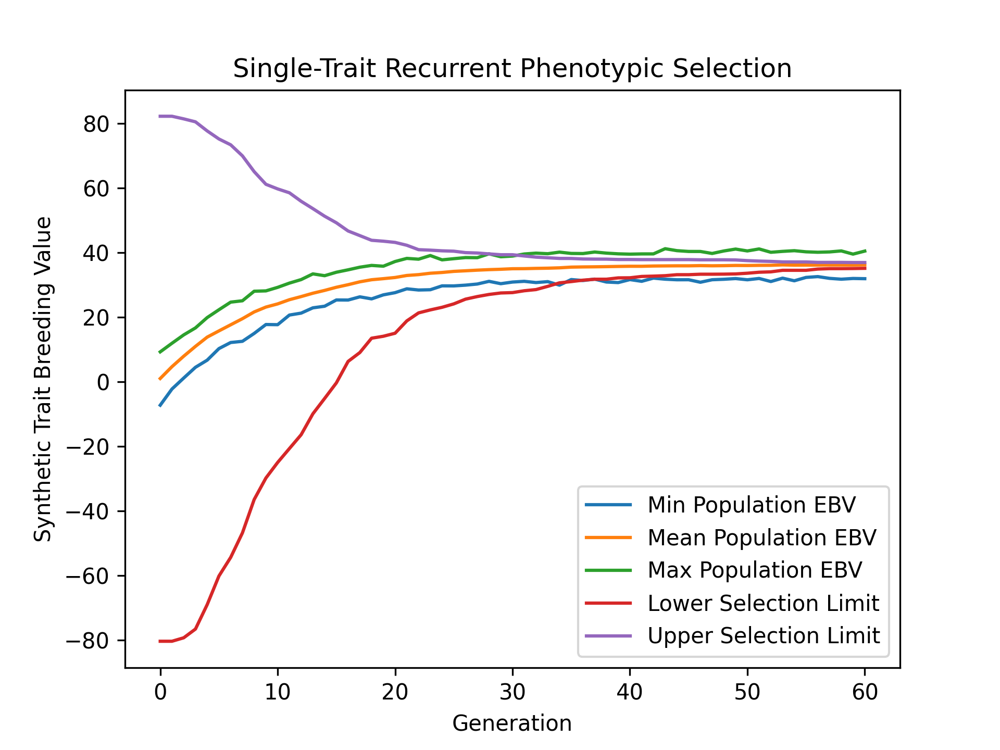

Single-Trait Phenotypic Selection
#################################

Simulating the evolution of a single trait over many generations of selection is useful in aiding breeding program decisions. Simulations allow for the comparison of different breeding strategies, allowing for the best breeding strategy to be selected. In this example, we demonstrate how to perform a simple, single-trait breeding simulation where a simple phenotypic selection with non-overlapping generations is used.

Simulation Preliminaries
========================

Loading Required Modules and Seeding the global PRNG
----------------------------------------------------

To begin, we import the various modules we will be used into the Python namespace. We also set the seed for our simulation so that we can replicate the results at a later time.

.. code-block:: python

    # import libraries
    import numpy
    import pandas
    import pybrops
    from matplotlib import pyplot
    from pybrops.breed.prot.bv.MeanPhenotypicBreedingValue import MeanPhenotypicBreedingValue
    from pybrops.breed.prot.mate.TwoWayCross import TwoWayCross
    from pybrops.breed.prot.mate.TwoWayDHCross import TwoWayDHCross
    from pybrops.breed.prot.pt.G_E_Phenotyping import G_E_Phenotyping
    from pybrops.breed.prot.sel.EstimatedBreedingValueSelection import EstimatedBreedingValueSubsetSelection
    from pybrops.model.gmod.DenseAdditiveLinearGenomicModel import DenseAdditiveLinearGenomicModel
    from pybrops.opt.algo.SortingSubsetOptimizationAlgorithm import SortingSubsetOptimizationAlgorithm
    from pybrops.popgen.gmap.HaldaneMapFunction import HaldaneMapFunction
    from pybrops.popgen.gmap.StandardGeneticMap import StandardGeneticMap
    from pybrops.popgen.gmat.DensePhasedGenotypeMatrix import DensePhasedGenotypeMatrix

    # seed python random and numpy random
    pybrops.core.random.prng.seed(648201539)

Loading Genetic Map Data from a Text File
-----------------------------------------

Next, we load genetic map data from a CSV-like file. In this example, we are using the US NAM genetic map constructed by McMullen et al. in 2009. The code below demonstrates how these data are read into a ``StandardGeneticMap`` object using the ``from_csv`` class method.

.. code-block:: python

    # read genetic map
    gmap = StandardGeneticMap.from_csv(
        "McMullen_2009_US_NAM.gmap",
        vrnt_chrgrp_col     = "chr",
        vrnt_phypos_col     = "pos",
        vrnt_genpos_col     = "cM",
        vrnt_genpos_units   = "cM",
        auto_group          = True,
        auto_build_spline   = True,
        sep                 = "\t",
        header              = 0,
    )

Creating a Genetic Map Function
-------------------------------

After loading our genetic map data, we want to create a genetic map function object which will be used to calculate recombination probabilities for our simulations. We create a simple Haldane genetic map function using the ``HaldaneMapFunction`` class.

.. code-block:: python

    # use Haldane map function to calculate crossover probabilities
    gmapfn = HaldaneMapFunction()

Loading Genome Data from a VCF File
-----------------------------------

Next, we load phased genetic markers from a VCF file. In this example, we are using a subset of genetic markers from the Wisconsin Maize Diversity Panel, which is composed of 942 individuals. 2000 SNPs with a minor allele frequency greater than 0.2 have been randomly selected to keep the dataset small.

.. code-block:: python

    # read phased genetic markers from a vcf file
    panel_pgmat = DensePhasedGenotypeMatrix.from_vcf(
        "widiv_2000SNPs.vcf.gz", # file name to load
        auto_group_vrnt = True,  # automatically sort and group variants
    )

After loading the genetic markers, we interpolate the genetic map positions and the sequential marker crossover probabilities using the ``interp_xoprob`` method. We interpolate using the genetic map and genetic map function we have just created.

.. code-block:: python

    # interpolate genetic map positions
    panel_pgmat.interp_xoprob(gmap, gmapfn)

Constructing a Single-Trait Genomic Model
-----------------------------------------

Next, we want to construct a true genomic model that will model a single trait with a strictly additive genetic architecture. We construct a ``DenseAdditiveLinearGenomicModel`` object to do this.

.. code-block:: python

    # model intercepts: (1,ntrait)
    beta = numpy.array([[0.0]], dtype = float)

    # marker effects: (nvrnt,1)
    mkreffect = numpy.random.normal(
        loc = 0.0,
        scale = 0.05,
        size = (panel_pgmat.nvrnt,1)
    )

    # trait names: (ntrait,)
    trait = numpy.array(["Syn1"], dtype = object)

    # create an additive linear genomic model to model traits
    algmod = DenseAdditiveLinearGenomicModel(
        beta        = beta,                 # model intercepts
        u_misc      = None,                 # miscellaneous random effects
        u_a         = mkreffect,            # random marker effects
        trait       = trait,                # trait names
        model_name  = "synthetic_model",    # name of the model
        hyperparams = None                  # model parameters
    )

Simulation Burn-in
==================

Select founders and randomly intermate for 20 generations
---------------------------------------------------------

Before we begin our simulation, we'll want to do a burn-in. The purpose of a burn-in is to create a set of genotypes with a population structure that is realistic to our desired simulation starting conditions. If one is using real data from a breeding program, this step may not be necessary. In other scenarios, it may be necessary to simulate a couple of generations of selection to create linkage block patterns akin to those found in a real breeding program. In the example below, we randomly select 40 founders from the individuals in the diversity panel data and conduct random mating for 20 generations. This simulates the creation of an open pollinated variety. After the 20 generations of random mating, we create doubled haploids from the population to serve as our starting breeding population for our simulation.

.. code-block:: python

    # founder population parameters
    nfndr = 40          # number of random founders to select (must be even)
    fndr_nmating = 1    # number of times to perform cross configuration (only needed for 3+ way crosses)
    fndr_nprogeny = 80  # number of progenies to derive from cross configuration
    fndr_nrandmate = 20 # number of random mating generations

    # create 2-way cross object
    mate2way = TwoWayCross()

    # randomly select and pair ``nfndr`` founders
    xconfig = numpy.random.choice(panel_pgmat.ntaxa,nfndr).reshape(nfndr//2,2)

    # randomly intermate ``nfndr`` founders to create initial hybrids
    fndr_pgmat = mate2way.mate(
        pgmat = panel_pgmat,
        xconfig = xconfig,
        nmating = fndr_nmating,
        nprogeny = fndr_nprogeny,
    )

    # randomly intermate for ``fndr_nrandmate`` generations
    # each individual in the population is randomly mated with another individual
    # and creates a single progeny so that the population size is held constant
    for _ in range(fndr_nrandmate):
        # get the number of taxa
        ntaxa = fndr_pgmat.ntaxa
        # randomly select and pair ``ntaxa`` parents
        xconfig = numpy.empty((ntaxa,2), dtype = int)
        xconfig[:,0] = numpy.random.choice(ntaxa, ntaxa, replace = False)
        xconfig[:,1] = numpy.random.choice(ntaxa, ntaxa, replace = False)
        # randomly intermate ``ntaxa`` parents
        fndr_pgmat = mate2way.mate(
            pgmat = fndr_pgmat,
            xconfig = xconfig,
            nmating = 1,
            nprogeny = 1,
        )

    # create a 2-way DH cross object, use the counters from the 2-way cross object
    mate2waydh = TwoWayDHCross(
        progeny_counter = mate2way.progeny_counter,
        family_counter  = mate2way.family_counter,
    )

    # get the number of taxa
    ntaxa = fndr_pgmat.ntaxa

    # randomly select and pair ``ntaxa`` parents
    xconfig = numpy.empty((ntaxa,2), dtype = int)
    xconfig[:,0] = numpy.random.choice(ntaxa, ntaxa, replace = False)
    xconfig[:,1] = numpy.random.choice(ntaxa, ntaxa, replace = False)

    # DH all individuals in the founder population to create our initial breeding population
    pgmat = mate2waydh.mate(
        pgmat = fndr_pgmat,
        xconfig = xconfig,
        nmating = 1,
        nprogeny = 1,
    )

Simulate phenotypic selection for 60 generations
================================================

Create a Phenotyping Protocol Object
------------------------------------

After creating our starting breeding population, we'll want to create a phenotyping protocol object to phenotype the individuals in our population. We'll create a :math:`G + E` phenotyping protocol that simulates the phenotyping of individuals in multiple environments, without :math:`G \times E` interactions. In the example below, we create a ``G_E_Phenotyping`` object where we test genotypes in 4 environments, each environment having 1 replication.

.. code-block:: python

    # create a phenotyping protocol object to simulate 4 environments with 1 rep each
    ptprot = G_E_Phenotyping(
        gpmod = algmod,
        nenv = 4,
        nrep = 1,
    )

To finalize construction of our phenotyping protocol object, we'll set the narrow sense heritability for a single observation using our starting breeding population.

.. code-block:: python

    # set the trait heritability using the initial population
    # initial population fits heritability assumptions of being randomly mated
    ptprot.set_h2(0.4, pgmat)

Create a Breeding Value Estimation Protocol Object
--------------------------------------------------

Next, we'll create a breeding value estimation object to take phenotypes simulated by our ``G_E_Phenotyping`` object and transform them into estimated breeding values. For this example, we'll simply calculate breeding values using the mean phenotypic value since our individuals are all inbred and we have no :math:`G \times E` effects.

.. code-block:: python

    # estimate breeding value using mean across environments for simplicity
    bvprot = MeanPhenotypicBreedingValue(
        taxa_col = "taxa",
        taxa_grp_col = "taxa_grp",
        trait_cols = "Syn1",
    )

Create a Selection Protocol Object
----------------------------------

Next, we'll want to create a selection protocol object to select based on estimated breeding values. For this selection problem, we can use a sorting algorithm to quickly identify the best individuals. Below, we create an optimization algorithm which does this.

.. code-block:: python

    # use a hillclimber for the single-objective optimization algorithm
    # this is a very general algorithm and may not be the most efficient for
    # all single-objective optimizations
    soalgo = SortingSubsetOptimizationAlgorithm()

After creating a custom optimization algorithm, we construct our selection protocol object. For this simulation, we want to select the top 40 individuals and pair them into 20 two-way crosses. Each cross will generate 80 progenies. We'll optimize using the sorting algorithm we created above.

.. code-block:: python

    # create a selection protocol that selects based on EBVs
    selprot = EstimatedBreedingValueSubsetSelection(
        ntrait      = 1,        # number of expected traits
        ncross      = 20,       # number of cross configurations
        nparent     = 2,        # number of parents per cross configuration
        nmating     = 1,        # number of matings per cross configuration
        nprogeny    = 80,       # number of progeny per mating event
        nobj        = 1,        # number of objectives == ntrait
        soalgo      = soalgo,   # use hillclimber to solve single-objective problem
    )

Rudimentary Logbook
-------------------

Next, we'll create a dictionary that will serve as a rudimentary logbook for our simulations.

.. code-block:: python

    # make a dictionary logbook
    lbook = {
        "gen"           : [],
        "meh"           : [],
        "lsl"           : [],
        "usl"           : [],
        "tbv_min_Syn1"  : [],
        "tbv_mean_Syn1" : [],
        "tbv_max_Syn1"  : [],
        "tbv_std_Syn1"  : [],
        "ebv_min_Syn1"  : [],
        "ebv_mean_Syn1" : [],
        "ebv_max_Syn1"  : [],
        "ebv_std_Syn1"  : [],
    }

Simulation Initialization
-------------------------

Before we can jump into the main loop for our simulations, we need to evaluate our simulated individuals and estimate breeding values. To do this, we use our phenotyping and breeding value estimation protocols. After evaluation, we calculate various metrics includeing mean expected heterozygosity, lower and upper selection limits, true breeding value min, mean, max, and standard deviation, and estimated breeding value min, mean, max, and standard deviation.

.. code-block:: python

    # initial phenotyping
    pheno_df = ptprot.phenotype(pgmat)

    # initial breeding value estimation
    bvmat = bvprot.estimate(ptobj=pheno_df)

    # log metrics
    lbook["gen"].append(0)
    lbook["meh"].append(pgmat.meh())
    lbook["lsl"].append(algmod.lsl(pgmat)[0])
    lbook["usl"].append(algmod.usl(pgmat)[0])
    tbv = algmod.gebv(pgmat).unscale()
    lbook["tbv_min_Syn1"].append(tbv.min(0)[0])
    lbook["tbv_mean_Syn1"].append(tbv.mean(0)[0])
    lbook["tbv_max_Syn1"].append(tbv.max(0)[0])
    lbook["tbv_std_Syn1"].append(tbv.std(0)[0])
    ebv = bvmat.unscale()
    lbook["ebv_min_Syn1"].append(ebv.min(0)[0])
    lbook["ebv_mean_Syn1"].append(ebv.mean(0)[0])
    lbook["ebv_max_Syn1"].append(ebv.max(0)[0])
    lbook["ebv_std_Syn1"].append(ebv.std(0)[0])
    print("Gen: {0}".format(0))

Main Simulation Loop
--------------------

For our main simulation loop, we'll do the same things we did in the initialization except we'll add a selection and mating step before evaluating and recording metrics.

.. code-block:: python

    # number of generations for which to simulate selection
    ngen = 60

    # simulate for ``ngen`` generations
    for gen in range(1,ngen+1):
        # select individuals
        selcfg = selprot.select(
            pgmat   = pgmat,    # genomes from which to build SelectionConfiguration
            gmat    = None,     # not required by this selection protocol
            ptdf    = None,     # not required by this selection protocol
            bvmat   = bvmat,    # breeding values (required)
            gpmod   = None,     # not required by this selection protocol
            t_cur   = 0,        # not required by this selection protocol
            t_max   = 0,        # not required by this selection protocol
        )
        # mate individuals
        pgmat = mate2waydh.mate(
            pgmat = selcfg.pgmat,
            xconfig = selcfg.xconfig,
            nmating = selcfg.nmating,
            nprogeny = selcfg.nprogeny,
        )
        # phenotype progenies
        pheno_df = ptprot.phenotype(pgmat)
        # estimate breeding values for progenies
        bvmat = bvprot.estimate(ptobj=pheno_df)
        # log metrics
        lbook["gen"].append(gen)
        lbook["meh"].append(pgmat.meh())
        lbook["lsl"].append(algmod.lsl(pgmat)[0])
        lbook["usl"].append(algmod.usl(pgmat)[0])
        tbv = algmod.gebv(pgmat).unscale()
        lbook["tbv_min_Syn1"].append(tbv.min(0)[0])
        lbook["tbv_mean_Syn1"].append(tbv.mean(0)[0])
        lbook["tbv_max_Syn1"].append(tbv.max(0)[0])
        lbook["tbv_std_Syn1"].append(tbv.std(0)[0])
        ebv = bvmat.unscale()
        lbook["ebv_min_Syn1"].append(ebv.min(0)[0])
        lbook["ebv_mean_Syn1"].append(ebv.mean(0)[0])
        lbook["ebv_max_Syn1"].append(ebv.max(0)[0])
        lbook["ebv_std_Syn1"].append(ebv.std(0)[0])
        print("Gen: {0}".format(gen))

Saving Results to a File
------------------------

Finally, we'll convert our rudimentary logbook dictionary into a Pandas DataFrame and export it to a CSV file for analysis.

.. code-block:: python

    # create output dataframe and save
    lbook_df = pandas.DataFrame(lbook)
    lbook_df.to_csv("lbook.csv", sep = ",", index = False)

Visualizing Breeding Program Simulation Results with ``matplotlib``
===================================================================

Visualizing True Breeding Values (TBVs)
---------------------------------------

To visualize how true breeding values evolved over the course of our simulation, we'll use ``matplotlib`` to plot the min, mean, and max true breeding values and compare them with the lower and upper selection limits. The code below demonstrates how to create this plot.

.. code-block:: python

    # create static figure
    fig = pyplot.figure()
    ax = pyplot.axes()
    ax.plot(lbook_df["gen"], lbook_df["tbv_min_Syn1"], label = "Min Population TBV")
    ax.plot(lbook_df["gen"], lbook_df["tbv_mean_Syn1"], label = "Mean Population TBV")
    ax.plot(lbook_df["gen"], lbook_df["tbv_max_Syn1"], label = "Max Population TBV")
    ax.plot(lbook_df["gen"], lbook_df["lsl"], label = "Lower Selection Limit")
    ax.plot(lbook_df["gen"], lbook_df["usl"], label = "Upper Selection Limit")
    ax.set_title("Single-Trait Recurrent Phenotypic Selection")
    ax.set_xlabel("Generation")
    ax.set_ylabel("Synthetic Trait Breeding Value")
    ax.legend()
    pyplot.savefig("single_trait_phenotypic_selection_true_breeding_values.png", dpi = 300)
    pyplot.close(fig)

The image below is the result of the code above.

.. image:: single_trait_phenotypic_selection_true_breeding_values.png

Visualizing Estimated Breeding Values (EBVs)
--------------------------------------------

To visualize how estimated breeding values evolved over the course of our simulation, we'll use ``matplotlib`` to plot the min, mean, and max estimated breeding values and compare them with the lower and upper selection limits. The code below demonstrates how to create this plot.

.. code-block:: python

    # create static figure
    fig = pyplot.figure()
    ax = pyplot.axes()
    ax.plot(lbook_df["gen"], lbook_df["ebv_min_Syn1"], label = "Min Population EBV")
    ax.plot(lbook_df["gen"], lbook_df["ebv_mean_Syn1"], label = "Mean Population EBV")
    ax.plot(lbook_df["gen"], lbook_df["ebv_max_Syn1"], label = "Max Population EBV")
    ax.plot(lbook_df["gen"], lbook_df["lsl"], label = "Lower Selection Limit")
    ax.plot(lbook_df["gen"], lbook_df["usl"], label = "Upper Selection Limit")
    ax.set_title("Single-Trait Recurrent Phenotypic Selection")
    ax.set_xlabel("Generation")
    ax.set_ylabel("Synthetic Trait Breeding Value")
    ax.legend()
    pyplot.savefig("single_trait_phenotypic_selection_estimated_breeding_values.png", dpi = 300)
    pyplot.close(fig)

The image below is the result of the code above.

