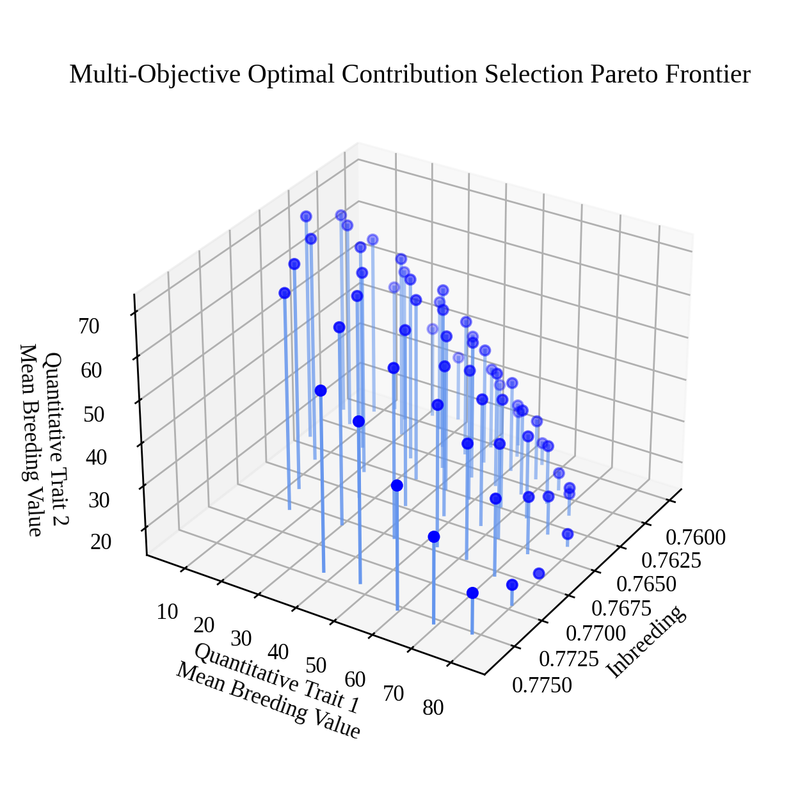

Tri-Objective Optimal Contribution Selection Pareto Frontier Visualization
##########################################################################

Optimial Contribution Selection (OCS) is a diversity preservation strategy commonly used in breeding. In OCS, the breeding value of a selected subset of individuals is maximized subject to an inbreeding constraint. This optimization can be generalized to a multi-objective scenario where one or more breeding values are maximized and inbreeding level is minimized, simultaneously. In this example, we demonstrate how to optimize and visualize an estimate of the Pareto frontier for a tri-objective OCS problem in a subset search space. In the tri-objective OCS problem, we seek to maximize the estimated breeding values (EBVs) for two traits and minimize the inbreeding between individuals in the selected subset, simultaneously.

Loading Required Modules and Seeding the global PRNG
====================================================

To begin, we import the modules we will be using into the Python namespace. To make our simulation replicable, we set the seed for the simulation using the ``seed`` function in the ``pybrops.core.random.prng`` module. This seeds the Python ``random`` and NumPy ``numpy.random`` modules with a single seed. We'll also want to import some image processing libraries such as ``matplotlib`` and ``PIL``.

.. code-block:: python

    # import libraries
    import os
    import numpy
    from matplotlib import pyplot
    from matplotlib import rcParams
    rcParams['font.family'] = 'Liberation Serif' # set default font
    from PIL import Image
    import pybrops
    from pybrops.breed.prot.sel.OptimalContributionSelection import OptimalContributionSubsetSelection
    from pybrops.opt.algo.NSGA3SubsetGeneticAlgorithm import NSGA3SubsetGeneticAlgorithm
    from pybrops.model.gmod.DenseAdditiveLinearGenomicModel import DenseAdditiveLinearGenomicModel
    from pybrops.popgen.gmat.DenseGenotypeMatrix import DenseGenotypeMatrix
    from pybrops.popgen.cmat.fcty.DenseMolecularCoancestryMatrixFactory import DenseMolecularCoancestryMatrixFactory

    # seed python random and numpy random
    pybrops.core.random.prng.seed(31621463)

Loading Genotypic Data from a VCF File
======================================

Next, we load our genotypic data from a VCF file named ``"widiv_2000SNPs.vcf.gz"`` using the ``from_vcf`` class method in the ``DenseGenotypeMatrix`` class. This creates an unphased genotype matrix with our SNPs coded as 0, 1, and 2. We automatically sort and group the genetic variants in the genotype matrix based on their chromosome assignments and physical positions using the ``auto_group_vrnt = True`` option.

.. code-block:: python

    # read unphased genetic markers from a vcf file
    gmat = DenseGenotypeMatrix.from_vcf(
        "widiv_2000SNPs.vcf.gz", # file name to load
        auto_group_vrnt = True,  # automatically sort and group variants
    )

Constructing a Bi-Trait Genomic Model
=====================================

Next, we construct a genomic model. The user may construct a genomic model by any means, including loading a model from file(s). Here, we simply construct a random bi-trait genomic model to represent two synthetic traits.

Below, we draw marker effects from a bi-variate normal distribution with negative covariance. This in effect, creates two traits with pleiotrophic effects which are competing in nature.

.. code-block:: python

    # make marker effects for two traits which are competing in nature
    # marker effects array is of shape (nvrnt, 2)
    mkreffect = numpy.random.multivariate_normal(
        mean    = numpy.array([0.0, 0.0]), 
        cov     = numpy.array([
                    [ 1.0, -0.4],
                    [-0.4,  1.0]
                ]), 
        size    = gmat.nvrnt
    )

.. code-block:: python

    # create an additive linear genomic model to model traits
    algmod = DenseAdditiveLinearGenomicModel(
        beta    = numpy.float64([[10.0, 25.0]]), # model intercepts
        u_misc  = None,                          # miscellaneous random effects
        u_a     = mkreffect,                     # random marker effects
        trait   = numpy.array(                   # trait names
                    ["syn1","syn2"],
                    dtype=object
                ),
        model_name = "synthetic_model",          # name of the model
        hyperparams = None                       # model parameters
    )

Constructing a Breeding Value Matrix
====================================

Next, we construct a breeding value matrix using our genomic model. The breeding value matrix will be used directly by the optimal contribution selection protocol in the steps following. Here, the user may construct a breeding value matrix by any means, including loading it from a file.

.. code-block:: python

    # calculate the GEBVs from the genotype matrix
    bvmat = algmod.gebv(gtobj = gmat)

Constructing an Optimal Contribution Subset Selection Object
============================================================

Next, we construct a ``CoancestryMatrixFactory`` object. The purpose of this object is to generate coancestry matrices from genotype matrices. The code below creates a factory object that will generate identity by state coancestry matrices. Other factory objects can be substituted here (e.g. VanRaden genomic relationship matrix, Yang genomic relationship matrix factory objects) to customize the OCS selection protocol object.

.. code-block:: python

    # create coancestry matrix factory object for creating
    # identity by state coancestry matrices
    ibscmatfcty = DenseMolecularCoancestryMatrixFactory()

Since the subset search space is large (there are 942 candidate individuals from which to choose), we'll want to provide a multi-objective optimization algorithm different from the default that will be able to optimize our weighted genomic selection problem. We'll make a slight variation on the default ``NSGA2SubsetGeneticAlgorithm`` and increase the number of algorithm generations from 250 to 1000.

.. code-block:: python

    # create custom multi-objective algorithm for optimization
    algo = NSGA3SubsetGeneticAlgorithm(
        ngen = 1500,    # number of generations to evolve
        pop_size = 100, # number of parents in population
        nrefpts = 91,   # number of reference points for optimization
    )

Next, we'll construct an optimal contribution selection protocol object. For this example, we desire to select 10 pairs of individuals (20 individuals total) from the 942 candidates in the genotype matrix. The code below demonstrates how this object is constructed.

.. code-block:: python

    # construct a subset selection problem for OCS
    selprot = OptimalContributionSubsetSelection(
        ntrait = 2,             # number of expected traits
        cmatfcty = ibscmatfcty, # identity by state
        unscale = True,         # whether to unscale breeding values
        ncross = 10,            # number of breeding crosses to select
        nparent = 2,            # number of parents per breeding cross to select
        nmating = 1,            # number of times parents are mated per cross
        nprogeny = 40,          # number of progenies to derive from a mating event
        nobj = 3,               # number of objectives (1+ntrait)
        moalgo = algo,          # custom multi-objective algorithm
        # leave all other arguments as their default values
    )

Estimating the Pareto Frontier
==============================

Using the optimal contribution selection protocol object we just constucted, we'll use the ``mosolve`` method to perform a multi-objective optimization to maximize the mean EBVs for both of our synthetic traits and minimize the inbreeding relationship in the selected subset of individuals. The ``OptimalContributionSubsetSelection.mosolve`` method only requires two non-``None`` arguments: ``gmat`` and ``bvmat``. We pass our genotype matrix and breeding value matrix objects as arguments for these two parameters, leaving the other arguments ``None`` or ``0``.

.. code-block:: python

    # estimate pareto frontier
    selsoln = selprot.mosolve(
        pgmat = None,   # argument not utilized
        gmat = gmat,    # ``gmat`` argument required
        ptdf = None,    # argument not utilized
        bvmat = bvmat,  # ``bvmat`` argument required
        gpmod = None,   # argument not utilized
        t_cur = 0,      # argument not utilized
        t_max = 0,      # argument not utilized
    )

Visualizing the Pareto Frontier with ``matplotlib``
===================================================

Creating a static image
-----------------------

After optimizing the objectives, we can use ``matplotlib`` or any other plotting packages to visualize the results of the optimization. The code below creates a figure to visualize the estimated Pareto frontier.

.. code-block:: python

    # set default font size
    rcParams['font.size'] = 10

    # image base name
    basename = "triobjective_OCS_pareto_frontier"

    # get axis data
    x =  selsoln.soln_obj[:,0] # 2 * mean kinship (additive relationship/inbreeding)
    y = -selsoln.soln_obj[:,1] # negate to get Breeding Value
    z = -selsoln.soln_obj[:,2] # negate to get Breeding Value
    z2 = numpy.ones(shape = x.shape) * min(z)

    # create static figure
    fig = pyplot.figure(figsize=(5,5))
    ax = pyplot.axes(projection = "3d")
    ax.scatter(x, y, z, color = "blue")
    for i,j,k,h in zip(x,y,z,z2):
        a = 0.5 * (i - min(x)) / (max(x) - min(x)) + 0.5
        ax.plot([i,i],[j,j],[k,h], color="cornflowerblue", alpha = a)

    ax.set_title("Multi-Objective Optimal Contribution Selection Pareto Frontier")
    ax.set_xlabel("Inbreeding")
    ax.set_ylabel("Quantitative Trait 1\nMean Breeding Value")
    ax.set_zlabel("Quantitative Trait 2\nMean Breeding Value")
    ax.view_init(elev = 30., azim = 32)
    pyplot.savefig(basename + ".png", dpi = 250)
    pyplot.close(fig)

Below is the resulting figure:

Creating an animation
---------------------

Since there are three objectives, visualization of the estimated Pareto frontier may be difficult to see from a single vantage point. We can create an animation using the ``PIL`` library or other packages. The code below creates an animation to visualize the estimated Pareto frontier in 3D space.

.. code-block:: python

    # set default font size
    rcParams['font.size'] = 10

    # image base name
    basename = "triobjective_OCS_pareto_frontier"

    # create animation frames output directory
    outdir = "frames"
    if not os.path.isdir(outdir):
        os.mkdir(outdir)

    # create animation frames
    for i in range(360):
        fig = pyplot.figure()
        ax = pyplot.axes(projection = '3d')
        ax.scatter3D(x, y, z)
        ax.set_title("Multi-Objective Optimal Contribution Selection Pareto Frontier")
        ax.set_xlabel("Inbreeding")
        ax.set_ylabel("Quantitative Trait 1\nMean Breeding Value")
        ax.set_zlabel("Quantitative Trait 2\nMean Breeding Value")
        ax.view_init(elev = 30., azim = i)
        pyplot.savefig(outdir + "/" + basename + "_" + str(i).zfill(3) + ".png", dpi = 250)
        pyplot.close(fig)

    # construct filenames from which to read
    filenames = [outdir + "/" + basename + "_" + str(i).zfill(3) + ".png" for i in range(360)]

    # read image files from which to create animation using PIL
    images = [Image.open(filename) for filename in filenames]

    # resize images to 50% size using PIL
    images_resize = [img.resize(tuple(px // 2 for px in img.size)) for img in images]

    # get first image
    img = images_resize[0]

    # create gif by appending remaining images to end of first image
    img.save(
        basename + ".gif", 
        save_all = True, 
        append_images = images_resize[1:], 
        optimize = True, 
        duration = 55,      # inverse of speed
        loop = 0,           # loop indefinitely
    )

Below is the resulting animation:

.. image:: triobjective_OCS_pareto_frontier.gif
